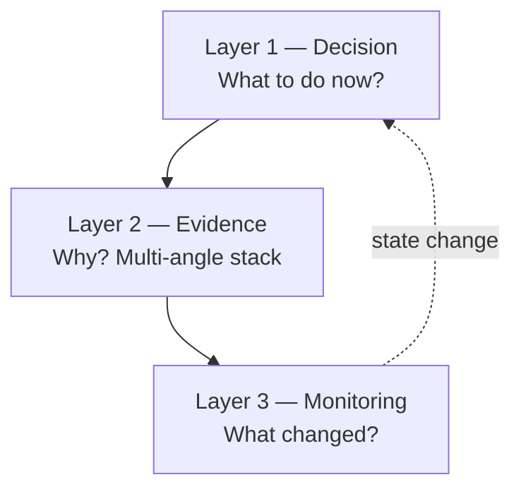

# Clarity Console — Alpha Operating System · 頂級 Developer Prompt（中文版 · 可直接 copy 開工）

**North star（一句）：**  
由「show me data」→ **tell me what matters, why it matters, and what to do next**。

**產品定位：**  
唔再係零散 dashboard，而係 **Alpha Operating System（AOS）** — 決策層 + 證據層 + 監控層，串成 signal → risk → allocation → execution → monitoring → learning。

**Institutional master prompts（英文 · 可直接 copy）：**
| 文件 | 用途 |
|------|------|
| [`INSTITUTIONAL_AOS_IMPLEMENTATION_PROMPT.md`](./INSTITUTIONAL_AOS_IMPLEMENTATION_PROMPT.md) | CIO/PM board 規則 + 11 段 deliverables |
| [`INSTITUTIONAL_AOS_EXECUTION_PROMPT.md`](./INSTITUTIONAL_AOS_EXECUTION_PROMPT.md) | **Agent 落手版** — repo audit、curl、tab 清單、Sprint ID、anti-fake PR 模板 |
| [`INSTITUTIONAL_AOS_MASTER_PROMPT_FULL.md`](./INSTITUTIONAL_AOS_MASTER_PROMPT_FULL.md) | 上文 **全文 verbatim**（A–J 能力規格完整版） |

**相關 spec（子文件，開工前先讀）：**
| 文件 | 範圍 |
|------|------|
| [`DECISION_SYSTEM_DEVELOPER_PROMPT_ZH.md`](./DECISION_SYSTEM_DEVELOPER_PROMPT_ZH.md) | Decision strip、Today、monitoring 四類、smart money 規則 |
| [`FUND_CONSOLE_DEVELOPER_PROMPT_ZH.md`](./FUND_CONSOLE_DEVELOPER_PROMPT_ZH.md) | Sleeve / FM / allocator / curve |
| [`PORTFOLIO_ANALYSIS_DEVELOPER_PROMPT_ZH.md`](./PORTFOLIO_ANALYSIS_DEVELOPER_PROMPT_ZH.md) | Allocator portfolio console、attribution、rebalance |
| [`SINGLE_STOCK_COMMAND_CENTER.md`](./SINGLE_STOCK_COMMAND_CENTER.md) | 單股 360 十層 |
| [`PM_PRODUCT_ROADMAP_10_10.md`](./PM_PRODUCT_ROADMAP_10_10.md) | Gap 表、狀態圖例、ticket ID |

**驗收：** `bash scripts/verify_10_10.sh` 全綠 + 每個主 surface **5 秒內**答完決策問題。

---

## 一、世界級 10/10 定義（唔係圖表多）

| 維度 | 10/10 係咩                                         | 唔係咩                |
| ---- | -------------------------------------------------- | --------------------- |
| 快   | 5 秒知要做咩                                       | 要巡十個 tab          |
| 準   | 假訊號有 evidence 降權                             | 社交 / 13F 當即時 buy |
| 深   | drill：stock → sleeve → portfolio → regime         | 只得 surface KPI      |
| 真   | live / paper / backtest / inferred 分開            | backtest α 當 live    |
| 連   | signal → risk → alloc → execution → monitor 一條線 | 各頁孤立              |
| 學   | decision 後可追蹤、回饋、優化                      | 無 memory             |
| 穩   | 核心有數、有 timestamp、有 fallback 標籤           | 靚但空心              |

**Blunt：** 下一步 **唔係加 20 張圖**，係 **decision clarity + evidence hierarchy + monitoring + attribution + execution linkage**。

---

## 二、三層架構（全平台必守）



### Layer 1 — Decision Layer（每個主頁頂部）

**Decision Summary Bar**（必備欄位）：

| 欄位             | 說明                                                    | 現有 hook                                                                 |
| ---------------- | ------------------------------------------------------- | ------------------------------------------------------------------------- |
| Verdict          | Buy / Hold / Trim / Avoid / Watch / Rebalance / Reduce  | `pm_answer.action_now`, `best_action`, `portfolio_decision.action_needed` |
| Conviction       | 0–100                                                   | `unified_decision.score`, ranked cards                                    |
| Evidence quality | Live / paper / backtest / mixed / weak                  | `evidence_badges`, `trust`                                                |
| Risk state       | Normal / Elevated / Extreme                             | `portfolio_risk_cockpit`, regime                                          |
| Next catalyst    | Earnings / macro / insider / options expiry / rebalance | `catalyst_calendar`, `catalysts`                                          |
| Time horizon     | Intraday / swing / medium / long                        | 要補 `time_horizon` on stock-intel                                        |
| Last update      | ISO timestamp                                           | 各 payload `as_of` / `generated_at`                                       |

**UI 規則：** `#pm-strip` + 各 tab 第一屏 = Decision Bar；數字放第二層。

### Layer 2 — Evidence Layer（每個 verdict 背後）

**Evidence stack**（唔係一句 AI summary）：

```
technical | fundamental | options | flows | insider | institutional |
macro/regime | peer RS | portfolio_fit | execution_readiness
```

**Confluence score（新，P2）：** 多信號交集分，唔好單一 RSI 決定。

**Smart money hierarchy（權重由高到低）：**

1. Insider cluster buy（Form 4, confirmed）
2. Long-dated options conviction（LEAPS / large premium directional）
3. Top institutional accumulation（13F delta, lagged）
4. Estimate revision momentum
5. Peer-relative strength
6. Public / political disclosure（supplemental only）
7. Social buzz（noise — 永不直接 BUY）

### Layer 3 — Monitoring Layer（會提醒你）

| 類          | 例子                                                   | 現有                                             |
| ----------- | ------------------------------------------------------ | ------------------------------------------------ |
| Stock       | level, RSI zone, vol, earnings, insider, options spike | `decision_hub.monitoring.stock`                  |
| Portfolio   | size, correlation, sector, stop, drawdown              | `monitoring.portfolio`, `portfolio_risk_cockpit` |
| Market      | VIX, breadth, rates, rotation                          | `monitoring.market`                              |
| Smart money | insider cluster, HF add, LEAPS build                   | `monitoring.smart_money`                         |

**要補：** 持久化 rules、`GET/POST /api/v7/monitors`、Discord/email dispatch、thesis drift engine。

---

## 三、現況對照（2026-05-25 baseline）

### 已落地 ✅（勿 regression）

| 能力                                     | API / 檔案                                                  |
| ---------------------------------------- | ----------------------------------------------------------- |
| Decision hub strip                       | `GET /api/v7/decision-hub` · `decision_hub.py`              |
| Today best action + near-miss + no-setup | `GET /api/v7/today` · `today_insights.py`                   |
| Avoid Now（分類）                        | `today.avoid_now` · `build_avoid_now_engine()`              |
| Stock intel + PM answer                  | `GET /api/v7/stock-intel/{t}` · `stock_intel.py`            |
| Fund / sleeve console                    | `fund_manager_console.py` · Funds tab                       |
| Portfolio decision console               | `GET /api/v7/portfolio-decision`                            |
| Risk cockpit                             | `GET /api/v7/portfolio-risk-cockpit`                        |
| Catalyst calendar                        | `GET /api/v7/catalyst-calendar`                             |
| PM memo                                  | `GET /api/v7/pm-memo?scope=`                                |
| Execution readiness                      | `execution_readiness` on today                              |
| Core stock universe                      | `src/core/stock_universe.py` · `GET /api/v7/stock-universe` |
| Evidence badges                          | `evidence_badges` on today                                  |

### 部分 🟡

| 能力              | 缺口                                                        |
| ----------------- | ----------------------------------------------------------- |
| Single stock 360  | fundamentals live 深度、options LEAPS/skew、peer matrix UI  |
| Smart money       | 13F delta、politician、influencer 分層未齊                  |
| Attribution       | portfolio-decision 有框架；Brinson / rolling α·β 未真       |
| Curve diagnostics | sleeve spark 有；rolling Sharpe / live vs backtest gap 未齊 |
| Commands          | quick macros 有；full power center + preview 未齊           |
| IB linkage        | readiness 有；position sync、bracket、reject log 淺         |

### 未做 ❌（按 sprint 排）

Thesis drift · PM memory · rebalance simulator · scenario shocks · crowding detector · leader accumulation center · cross-sleeve allocator · trade journal · execution slippage review · persistent monitors CRUD

---

## 四、單股 Master Page — 10/10 模組清單

> 實作以 **一頁 360 command center** 為準，唔再拆散到 8 個無 verdict 嘅 tab。  
> Spec 細節：[`SINGLE_STOCK_COMMAND_CENTER.md`](./SINGLE_STOCK_COMMAND_CENTER.md)

| #   | 模組                         | 必須輸出                                                                                                | 狀態 |
| --- | ---------------------------- | ------------------------------------------------------------------------------------------------------- | ---- |
| 1   | **Top Action Header**        | verdict, entry quality, trend, risk, horizon, evidence, next catalyst, PM note                          | 🟡   |
| 2   | **Technical Intelligence**   | MTF trend, S/R, RSI/MACD/vol, RS vs sector/SPY, structure, chase/pullback/stop scores                   | 🟡   |
| 3   | **Fundamental Intelligence** | growth, margins, FCF, debt, valuation vs peers/hist, revision momentum, quality-growth composite, flags | 🟡   |
| 4   | **Peer / Industry**          | vs industry + top5 peers；winner/laggard/crowded labels                                                 | 🟡   |
| 5   | **Insider / Smart money**    | 分層 a–d；**禁止** gossip buy signal                                                                    | 🟡   |
| 6   | **Options / Positioning**    | skew, sweeps, IV pct, OI, gamma, LEAPS, flow quality                                                    | 🟡   |
| 7   | **Catalyst calendar**        | earnings, macro sensitivity, strength score                                                             | 🟡   |
| 8   | **Composite thesis**         | bull/bear/base, breaks/improves, monitor next                                                           | 🟡   |
| 9   | **Portfolio fit**            | overlap, beta, concentration impact, diversifier score                                                  | ❌   |
| 10  | **Execution bridge**         | preview size, send to IB, alert, watch                                                                  | ❌   |

**API 擴展建議：**

```http
GET /api/v7/stock-intel/{ticker}?layers=all
```

Response 新增頂層：

```json
{
  "decision_bar": { "verdict", "conviction", "evidence_quality", "risk_state", "next_catalyst", "time_horizon", "as_of" },
  "confluence": { "score", "signals": [] },
  "portfolio_fit": { "score", "overlap_tickers", "beta_delta" },
  "thesis": { "bull", "bear", "base", "invalidation", "monitor_next" }
}
```

---

## 五、Portfolio / Fund / Allocator — 10/10 模組

| 模組                      | 必須輸出                                                          | 狀態 | 文件                    |
| ------------------------- | ----------------------------------------------------------------- | ---- | ----------------------- |
| Active FM / Sleeve center | stance, mode, controls_capital, curve, regime fit, investable now | ✅   | FUND_CONSOLE            |
| Portfolio health          | diversification, correlation, drawdown, turnover, liquidity       | 🟡   | portfolio_risk_cockpit  |
| Current vs target weight  | drift, rebalance urgency                                          | 🟡   | portfolio_decision      |
| Attribution               | return / vol / drawdown contribution by asset                     | 🟡   | portfolio_decision      |
| Curve intelligence        | equity, underwater, rolling Sharpe/α/β, live vs backtest gap      | 🟡   | fund cards              |
| IB / execution            | connected, sync, buying power, order readiness, rejects           | 🟡   | execution_readiness     |
| Monitor / alerts          | thesis weaken, drift, correlation spike, catalyst                 | 🟡   | decision_hub.monitoring |
| Cross-sleeve allocator    | strongest/weakest sleeve, allocation recommendation               | 🟡   | fund_manager_console    |

---

## 六、30 項高價值功能 — 優先序與 Sprint

### 必加（最高優先 · Sprint 1 — Decision & Monitoring）

| ID   | Feature                                            | Ticket                                              |
| ---- | -------------------------------------------------- | --------------------------------------------------- |
| S1-1 | **Decision Summary Bar** 全主 tab 統一 component   | `decision_bar` schema + `index.html` shared partial |
| S1-2 | Active fund / sleeve monitor 強化                  | FUND_CONSOLE §1–3                                   |
| S1-3 | Current vs target weight + rebalance box           | `portfolio_decision_console.py`                     |
| S1-4 | Attribution by asset（真數或 labeled fallback）    | 接 `benchmark_portfolio.py`                         |
| S1-5 | Curve diagnostics（rolling + live/backtest label） | `model_funds.py`                                    |
| S1-6 | IB linkage state 全頁可見                          | execution panel on Portfolio + Today                |
| S1-7 | Monitor / alert panel + Avoid Now UI               | Today + `avoid_now` categories UI                   |
| S1-8 | Evidence quality 全平台                            | extend `evidence_badges` → per-score `trust`        |

### 高優先（Sprint 2 — Single Stock 360）

| ID   | Feature                                           | Ticket                               |
| ---- | ------------------------------------------------- | ------------------------------------ |
| S2-1 | Top Action Header on dossier                      | stock-intel `decision_bar`           |
| S2-2 | Fundamental block live                            | yfinance / internal + revision trend |
| S2-3 | Peer comparison engine                            | `GET /api/dossier/{t}/peer-matrix`   |
| S2-4 | Options intelligence（LEAPS, skew, flow quality） | dossier options + stock-intel layers |
| S2-5 | Insider + institutional structured                | `smart_money_tracker.py`             |
| S2-6 | Catalyst calendar widget                          | catalyst_calendar + dossier          |
| S2-7 | Composite thesis + challenge memo                 | `pm_memo` scope=ticker + bear case   |
| S2-8 | Influencer / disclosure **分層**（非 buy signal） | smart money tier 5–7 only            |

### 高優先（Sprint 3 — Portfolio Intelligence）

| ID   | Feature                       | Ticket                                    |
| ---- | ----------------------------- | ----------------------------------------- |
| S3-1 | Regime fit panel              | portfolio_decision.regime_fit             |
| S3-2 | Rolling α / β / Sharpe        | performance service                       |
| S3-3 | Portfolio-fit score per stock | new `portfolio_fit.py`                    |
| S3-4 | Correlation heatmap           | portfolio_risk_cockpit                    |
| S3-5 | Scenario analysis             | `scenario_engine.py` wire UI              |
| S3-6 | Rebalance simulator           | new endpoint POST `/api/v7/rebalance-sim` |

### 進階（Sprint 4 — Smart Alpha Layer）

| ID   | Feature                            | Ticket                               |
| ---- | ---------------------------------- | ------------------------------------ |
| S4-1 | Smart money hierarchy + confluence | `confluence_engine.py`               |
| S4-2 | Top leaders accumulation center    | `leaders_tracker.py`                 |
| S4-3 | Thesis drift engine                | `thesis_drift.py`                    |
| S4-4 | PM memory / research memory        | `pm_memory.py` + per-ticker timeline |
| S4-5 | Strategy / sleeve allocator        | cross-sleeve on fund console         |
| S4-6 | Trade journal ↔ thesis            | link orders to `pm_memory`           |
| S4-7 | Crowding detector                  | options OI + 13F overlap             |
| S4-8 | Why-this-not-that compare          | `GET /api/v7/compare?a=NVDA&b=AMD`   |

---

## 七、可直接貼俾 Claude / Copilot / Cursor 的英文 Prompt

```text
Upgrade Clarity Console (TradingAI_Bot) from a rich analytics dashboard into an
institutional-grade Alpha Operating System (AOS).

NON-NEGOTIABLE PRODUCT RULE:
Every major surface must answer in <5 seconds:
- What should I do now?
- Why (multi-angle evidence)?
- What changed (monitoring)?
- How strong is the evidence (live/paper/backtest/mixed)?
- What is the risk and position size implication?

ARCHITECTURE (implement in this order):
1) Decision Layer — Decision Summary Bar on Today, Portfolio, Funds, Dossier, Signals
2) Evidence Layer — stacked evidence per verdict; smart-money hierarchy (never gossip buys)
3) Monitoring Layer — persistent alerts, thesis drift, portfolio/market/smart-money monitors

ALREADY SHIPPED (do not regress):
- GET /api/v7/decision-hub, /today, /stock-intel/{t}, /portfolio-decision,
  /portfolio-risk-cockpit, /catalyst-calendar, /pm-memo, avoid_now on today,
  fund_manager_console, execution_readiness, stock_universe
- UI: pm-strip decision pills, dossier PM answer, portfolio allocator blocks

SPRINT 1 (highest ROI):
- Unify Decision Summary Bar component (verdict, conviction, evidence_quality,
  risk_state, next_catalyst, time_horizon, as_of) across tabs
- Harden portfolio: current vs target weight, rebalance urgency, attribution
- Curve diagnostics with live vs backtest labels on sleeves
- IB linkage visible on portfolio + execution readiness
- Surface avoid_now categories on Today; expand monitoring CRUD + dispatch

SPRINT 2 — Single Stock 360:
- Extend GET /api/v7/stock-intel/{t} with decision_bar, confluence, portfolio_fit, thesis
- Live fundamentals + peer matrix + options (LEAPS/skew/flow quality)
- Structured insider/institutional/disclosure tiers (supplemental only for politicians/influencers)
- Dossier UI: one scrollable command center, PM verdict sticky, challenge memo

SPRINT 3 — Portfolio intelligence:
- Rolling alpha/beta/Sharpe, correlation heatmap, regime fit, scenario + rebalance sim

SPRINT 4 — Smart alpha:
- Confluence engine, leaders accumulation center, thesis drift, PM memory, compare engine

EVIDENCE RULES:
- Every score shows: basis (live|paper|backtest|mixed), sample_size, freshness, source_quality
- No BUY from influencer/social alone; 13F is lagged; label timeliness on every smart-money row

SMART MONEY WEIGHT ORDER:
insider cluster > LEAPS conviction > institutional accumulation > revisions > peer RS >
public disclosure > social noise

FILES TO READ FIRST:
docs/ALPHA_OPERATING_SYSTEM_DEVELOPER_PROMPT_ZH.md
docs/DECISION_SYSTEM_DEVELOPER_PROMPT_ZH.md
docs/FUND_CONSOLE_DEVELOPER_PROMPT_ZH.md
docs/PORTFOLIO_ANALYSIS_DEVELOPER_PROMPT_ZH.md
docs/SINGLE_STOCK_COMMAND_CENTER.md
src/services/decision_hub.py, today_insights.py, stock_intel.py,
portfolio_decision_console.py, fund_manager_console.py
src/api/templates/index.html

VERIFY: bash scripts/verify_10_10.sh must pass after each PR batch.
```

---

## 八、實作任務包（按 Sprint 拆 PR）

### Sprint 1 — Task pack

```
A1. Add shared DecisionSummaryBar schema in src/schemas/decision_bar.py
A2. decision_hub + today + portfolio_decision return decision_bar at top level
A3. index.html: render bar on Today, Portfolio, Funds, Dossier (above data grids)
A4. Portfolio: wire target_weight drift from portfolio_decision_console
A5. Fund cards: rolling_sharpe_20d, live_vs_backtest_gap label on curve
A6. GET/POST /api/v7/monitors — persist rules in data/monitors.json (no user path injection)
A7. Tests: test_decision_bar.py, extend test_portfolio_decision_console.py
```

### Sprint 2 — Task pack

```
B1. stock_intel.build_decision_bar() + confluence stub from layers
B2. peer-matrix endpoint; fundamentals from live quote service
B3. options layer: IV percentile, unusual volume, LEAPS flag from options tab data
B4. smart_money_tracker.py — evidence_type, signal_quality, relevance, timeliness per row
B5. Dossier UI accordion 8 blocks + sticky verdict footer
B6. unittest tests/test_stock_intel.py — no BUY on rumor quality
```

### Sprint 3 — Task pack

```
C1. portfolio_fit.py — overlap, beta impact, diversifier score
C2. correlation heatmap in portfolio_risk_cockpit
C3. rebalance-sim POST endpoint
C4. scenario_engine wire to portfolio tab
```

### Sprint 4 — Task pack

```
D1. thesis_drift.py — compare entry thesis vs current layers
D2. pm_memory.py — append-only research notes per ticker
D3. leaders_tracker.py — repeated accumulation across quality funds
D4. GET /api/v7/compare?a=&b= — why this not that
```

---

## 九、檔案地圖（AOS）

| 層            | 路徑                                                                                                          |
| ------------- | ------------------------------------------------------------------------------------------------------------- |
| Decision      | `src/services/decision_hub.py`, `best_action.py`, `portfolio_decision_console.py`                             |
| Evidence      | `src/services/stock_intel.py`, `today_insights.py`, `pm_memo.py`                                              |
| Monitoring    | `decision_hub.monitoring`, `catalyst_calendar.py`, `portfolio_risk_cockpit.py`                                |
| Fund / sleeve | `src/services/fund_manager_console.py`                                                                        |
| Universe      | `src/core/stock_universe.py`                                                                                  |
| UI            | `src/api/templates/index.html`                                                                                |
| Routers       | `decision_hub.py`, `decision.py`, `stock_intel.py`, `portfolio_decision.py`, `platform_extras.py`, `funds.py` |
| Verify        | `scripts/verify_10_10.sh`                                                                                     |

---

## 十、Definition of Done（機構級驗收）

**PM 30 秒測試（每個主 tab）：**

| Tab       | 必須講得出                                            |
| --------- | ----------------------------------------------------- |
| Today     | Deploy/Reduce/Wait、best idea、avoid 幾類、monitor 咩 |
| Portfolio | Rebalance 急唔急、邊隻貢獻 risk、target drift         |
| Funds     | 邊個 sleeve active、邊個控資金、curve 健康嗎          |
| Dossier   | Buy/Watch/Avoid、why now、why not、evidence 質量      |
| Signals   | Top ranked 嘅 NOW vs WAIT、evidence badge             |

**技術驗收：**

- [ ] `bash scripts/verify_10_10.sh` → `10/10 PASS`
- [ ] 每個主 API 有 `as_of` + evidence `basis`
- [ ] 無 backtest 數字無 label 當 live
- [ ] Smart money 無「某人買咗=bullish」句式
- [ ] Decision Bar 在 ≥4 個主 tab 可見

---

## 十一、應降級 / 後做（避免假 10/10）

| 降級                            | 原因                       |
| ------------------------------- | -------------------------- |
| 裝飾性 chart 重複               | 搶 decision 首屏           |
| AI 做主 ranking                 | 無 calibrated track record |
| Influencer feed 主視覺          | 變 gossip                  |
| 無節制新 tab                    | 破壞 hierarchy             |
| Auto live order without confirm | 合規 / 安全                |

---

## 十二、給 Product / PM 的一句話

**10/10 核心唔係圖表多，而係：每一頁都係決策頁 — 先講 action，再疊 evidence，最底層監控變化。**

本文件為 **master prompt**；實作時按 Sprint 1→4 開 PR，每批跑 `verify_10_10.sh`，子 spec 見上文連結。
