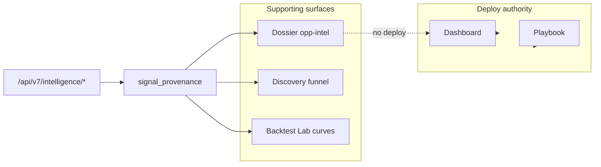

# CC · Clarity Console — Opportunity Intelligence Roadmap

Branch baseline: `sprint99-fund-productization` @ 4b2f409 (9.9/10 authority model).

## 1. EXECUTIVE UPGRADE VERDICT

**Verdict: Proceed with supporting-surface upgrade — foundation shipped.**

CC gains insider (Form 4), institutional (13F), event narrative, and strategy-curve context **without** expanding deploy authority. Page gates on Dashboard / Playbook remain sole deploy surfaces; Dossier / Discovery / Funds stay `research_only`. News and lagged filings are explicitly **downgrade-only or monitor-only**. Strategy curves inform sizing templates in Backtest Lab research — never handoff permission alone.

**Risk controls preserved:** `signal_provenance.py` ceilings, provenance envelopes on all `/api/v7/intelligence/*` routes, instant degraded stubs in `_cc_instant.py`, and dossier UI badges via `CCHelpers.opportunityIntelligenceBadge`.

---

## 2. NEW FEATURE ARCHITECTURE (insider, 13F, event, strategy-curve)

| Layer     | Insider (Form 4)                   | Institutional (13F)    | Event narrative                    | Strategy curve                  |
| --------- | ---------------------------------- | ---------------------- | ---------------------------------- | ------------------------------- |
| Service   | `insider_tracker.py`               | `institutional_13f.py` | `event_noise_filter.py`            | `strategy_curve_health.py`      |
| Authority | `research_only`                    | `research_only`        | `confirmation_only` (downgrade)    | `research_only`                 |
| API       | `GET /api/v7/intelligence/insider` | `.../institutional`    | `.../events`                       | `.../strategy-health`           |
| UI        | Dossier opp-intel strip            | Same strip (13F block) | Playbook/Dashboard badges (medium) | Backtest Lab extension (medium) |
| Monitor   | `insider_cluster`                  | `13f_sponsorship`      | `event_clear`                      | `strategy_health`               |

**Data flow:** Router → provenance envelope → Alpine `dos.oppIntel` (dossier) / Today `monitor_triggers` (hooks). Live EDGAR / news ingest is medium-term; mock paths label `data_tier: mock` and `degraded: true`.

---

## 3. EXACT ROADMAP (immediate / medium / deep / optional)

### Index + Algo Intelligence (Phase A shipped · Phase B deferred)

**Phase A (monitor-only):** `index_regime.py` (VIX/breadth/factor/cross-asset), `index_relative_leadership.py`, playbook enrich (`regime_fit`, `execution_fit`, `liquidity_fit`, `index_leadership`), Today `index_regime_summary` + `regime_strip`, `execution_algo_selector.py` stub, allocator downgrade routing.

**Phase B (next):** Full execution analytics console on IBKR tab; BTLab strategy curve console UI; factor exposure dashboard for full book diagnostics.

### Immediate (shipped in this pass)

- `signal_provenance.py` — per-signal authority ceilings
- Four intelligence services + unit tests
- `opportunity_intelligence` router (4 endpoints)
- `_cc_instant.py` degraded handlers for intelligence paths
- Dossier UI: insider + institutional strip (`data-cc="dossier-opp-intel"`)
- `cc-helpers.js` labels: badge, insider label, event downgrade, curve pill
- `today_insights.build_monitor_triggers` + `fetch_surface_state.OPPORTUNITY_MONITOR_TRIGGER_TYPES`

### Medium

- Wire `insider_tracker` to `EdgarClient` (`/api/edgar/{ticker}/insider`) behind feature flag
- Event-risk badge on Dashboard / Playbook cards (downgrade path only)
- Institutional block on Funds tab
- Strategy Curve Console panel on Backtest Lab (`btlab` surface mode)
- Pass `opportunity_hints` into Today payload from scanner near-miss

### Deep

- Real-time news clustering with provider SLA + stale badges
- 13F diff engine vs prior quarter with holder concentration time series
- Insider cluster detector across tickers for Discovery funnel
- Integration with `decision_truth_model` for explicit downgrade reasons on event tier A negative

### Optional

- Separate nav tab “Intel” (hidden command surface) — only if operator demand
- Push notify on `insider_cluster` — monitor alert, not trade alert
- Cross-name 13F “crowded exit” sector monitor

---

## 4. FILE-LEVEL PLAN

| Action                               | Path                                                                                                                        |
| ------------------------------------ | --------------------------------------------------------------------------------------------------------------------------- |
| **New**                              | `src/services/signal_provenance.py`                                                                                         |
| **New**                              | `src/services/insider_tracker.py`                                                                                           |
| **New**                              | `src/services/institutional_13f.py`                                                                                         |
| **New**                              | `src/services/event_noise_filter.py`                                                                                        |
| **New**                              | `src/services/strategy_curve_health.py`                                                                                     |
| **New**                              | `src/api/routers/opportunity_intelligence.py`                                                                               |
| **New**                              | `tests/test_opportunity_intelligence.py`                                                                                    |
| **New**                              | `tests/test_insider_tracker.py`, `test_institutional_13f.py`, `test_event_noise_filter.py`, `test_strategy_curve_health.py` |
| **Edit**                             | `src/api/main.py` — register router                                                                                         |
| **Edit**                             | `_cc_instant.py` — degraded intelligence                                                                                    |
| **Edit**                             | `src/services/today_insights.py` — monitor trigger types                                                                    |
| **Edit**                             | `src/services/fetch_surface_state.py` — monitor labels                                                                      |
| **Edit**                             | `src/api/templates/index.html` — dossier strip + `fetchOpportunityIntel`                                                    |
| **Edit**                             | `src/api/static/cc-helpers.js` — UI copy helpers                                                                            |
| **Existing (read-only integration)** | `surface_authority.py`, `decision_truth_model.py`, `fetch_surface_state.py`, discovery via `playbook.py` scanners           |

---

## 5. DIRECT IMPLEMENTATION (what you built)

1. **Authority contracts** — `signal_provenance` with `deploy_from_signal_alone: False` on every envelope.
2. **Services** — scoring/labels for Form 4, 13F change types, event clustering, curve health states (`full_size` … `paused`).
3. **API** — `/api/v7/intelligence/{insider,institutional,events,strategy-health}` with API key dependency.
4. **Instant path** — cold-start JSON via `_stale_opportunity_intelligence_bytes`.
5. **UI** — Dossier “Opportunity context (lagged)” card with RESEARCH ONLY badge; parallel fetch on dossier load.
6. **Daily hooks** — `opportunity_hints` parameter on `build_monitor_triggers`; `OPPORTUNITY_MONITOR_TRIGGER_TYPES` in fetch_surface_state.

---

## 6. TEST PLAN

| Suite                 | Command                                                                                                                                        | Expect                                    |
| --------------------- | ---------------------------------------------------------------------------------------------------------------------------------------------- | ----------------------------------------- |
| Opportunity authority | `pytest tests/test_opportunity_intelligence.py -q`                                                                                             | No deploy from signals; research ceilings |
| Unit services         | `pytest tests/test_insider_tracker.py tests/test_institutional_13f.py tests/test_event_noise_filter.py tests/test_strategy_curve_health.py -q` | Scoring/classify/cluster                  |
| Canonical subset      | `pytest tests/test_surface_authority_header.py tests/test_decision_authority.py -q`                                                            | No regression on header/authority         |
| Manual                | Load Dossier AAPL → see opp-intel strip; curl intelligence endpoints with `X-API-Key`                                                          | MOCK/DEGRADED badges when instant         |

---

## 7. DO / DON'T RULES

### DO

- Keep **page gate > card temptation** — deploy chips only on Dashboard / Playbook.
- Label all intelligence **RESEARCH ONLY** or **MOCK ONLY** when stubbed/degraded.
- Use insider/13F as **lagged context** in Dossier and monitor queue.
- Treat news/events as **narrative/risk** with `downgrade_only` on event payloads.
- Show strategy curves in **Backtest Lab / research** surfaces with `deploy_from_curve_alone: false`.
- Cross-check `decision_truth_model` before any future card-level downgrade wiring.

### DON'T

- Don't set `may_authorize_deploy` on intelligence signal types.
- Don't upgrade `tradeability` from insider cluster or 13F sponsorship alone.
- Don't show TRADE badges on Dossier opp-intel strip.
- Don't conflate `strategy_health_service` (realized trades) with `strategy_curve_health` (walk-forward research).
- Don't hide mock data — always expose `data_tier` and `degraded` in API + UI badge.
