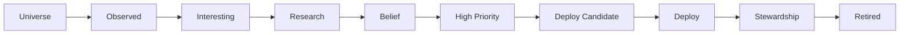
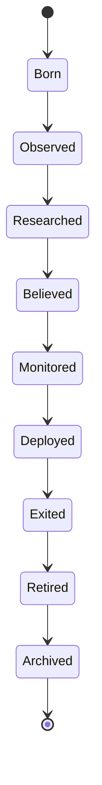
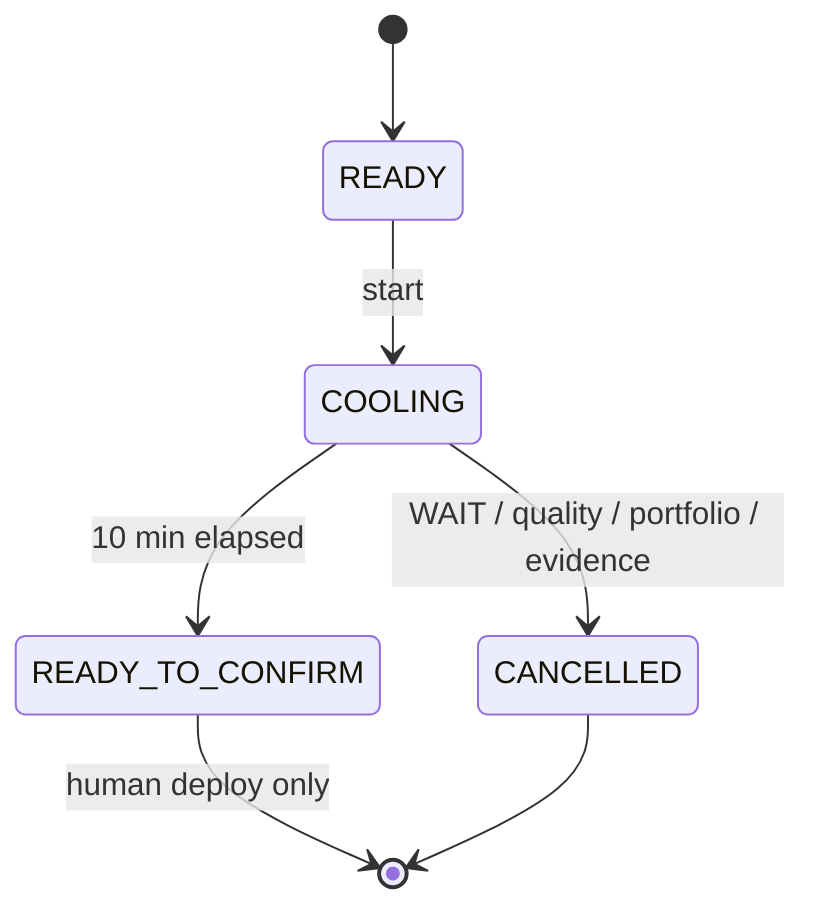

# CC X — Architecture Source of Truth

**Product:** CC X (Clarity Console X) · `TradingAI_Bot`  
**Subtitle:** Investment Decision Operating System (IDOS)  
**Version:** 9.0.0 (`src/core/version.py`)  
**Last verified:** 2026-08-25 (Phase A `59db29f` + Phase B stubs on branch)

Work tracking → [`CC_X_ENGINEERING_BACKLOG.md`](./CC_X_ENGINEERING_BACKLOG.md) · Ops → [`CC_X_PRODUCTION_READINESS.md`](./CC_X_PRODUCTION_READINESS.md) · ADRs → [`CC_X_DECISION_LOG.md`](./CC_X_DECISION_LOG.md) · Governance → [`CC_X_INVESTMENT_COMMITTEE_RESOLUTION.md`](./CC_X_INVESTMENT_COMMITTEE_RESOLUTION.md)

> Architecture facts only — no roadmap, scores, or opinions.

---

## Constitution & Four Questions (operator model)

Binding philosophy → [`CC_X_INVESTMENT_COMMITTEE_RESOLUTION.md`](./CC_X_INVESTMENT_COMMITTEE_RESOLUTION.md). After the Constitution, **The Four Questions** are immutable law for every surface:

| # | Question | Code role |
|---|----------|-----------|
| 1 | **What do we know?** | Provenance, freshness, regime facts, forward outcomes |
| 2 | **What do we believe?** | Beliefs, IO/Alpha thesis, conviction, quality tiers |
| 3 | **What don't we know?** | Missing evidence, assumptions, near-miss, calibration gaps |
| 4 | **What should we do?** | `deploy_open`, Monitor / Research / Repair / Wait |

**Operator mental model:** **KNOW → BELIEVE → DOUBT → ACT** — not engines or tabs. Every screen should open with Today framing (know / believe / don't know / therefore) before indicators or scores.

**Closing principle:** The market is uncertain. Our process should not be. CC exists to help the operator continuously reduce avoidable uncertainty before risking irrecoverable capital.

### Decision Quality Pyramid

Information → Understanding → Belief → Decision → Execution → Outcome → Learning → **Wisdom**

CC Learning loop (forward outcomes, belief review) ends at Learning; **IDOS layer** adds pre-outcome journal + challenge engines to compound toward Wisdom. Optimize: Decision Quality → Decision Process → **Investor Character**.

### IDOS layer — five capabilities (internal → operator)

| Capability | Module | API (v7) | Authority | Four Questions |
|------------|--------|----------|-----------|----------------|
| Decision Journal | `decision_journal.py` | `POST/GET …/decision-journal/*` | `research_only` | Q2 Believe · Q3 Doubt · Q4 Act |
| Red Team | `red_team.py` | `GET …/red-team/challenge` | `research_only` | Q3 Doubt |
| Outside View | `outside_view.py` | `GET …/outside-view/base-rate` | `research_only` | Q1 Know · Q3 Doubt |
| Decision Committee | `decision_committee.py` | `GET …/decision-committee/review` | `research_only` | Q2 Believe · Q3 Doubt |
| Decision Health | `decision_health.py` | `GET …/decision-health/summary` | `research_only` (non-blocking) | Q1 Know · Q3 Doubt |

Flow: **Decision → Outcome → Learning** (never Outcome → Explanation). Journal entries written **before** outcome known.

### Maturity table (2026-08-25)

| Layer | Score |
|-------|------:|
| Architecture · Authority · Constitution · CIIO · Alpha Flywheel · Meta Intelligence | 10 each |
| Decision Journal · Red Team · Outside View · Decision Committee · Decision Health | Missing → Phase 1/stubs (CCX-156–161) |

---

## Runtime topology

```
Browser (Alpine.js SPA — src/api/templates/index.html, cc-app.js)
    ↓
_cc_instant.py :8000  →  proxy  →  FastAPI uvicorn :8001
    ↓
src/api/routers/*  (domain HTTP)
    ↓
src/services/*     (orchestration, contracts, truth model)
src/engines/*      (regime, signals, council, scanner)
    ↓
External: IBKR (ibkr_service.py), yfinance/Polygon, Discord/Telegram, optional LLM
```

| Layer        | Location                                   | Role                                                     |
| ------------ | ------------------------------------------ | -------------------------------------------------------- |
| Instant boot | `_cc_instant.py`                           | Sub-second shell; proxies API; gzip dashboard cache      |
| API          | `src/api/routers/` (~61 routers)           | HTTP surfaces per tab/domain                             |
| Services     | `src/services/`                            | Authority contracts, decision truth, board, dossier, ops |
| Engines      | `src/engines/`                             | Regime routing, signal generation, opportunity scan      |
| Scheduler    | `src/scheduler/main.py`                    | Premarket / intraday / EOD jobs (US/Eastern)             |
| UI           | `index.html`, `cc-app.js`, `cc-helpers.js` | Alpine.js operator dashboard                             |

---

## Domain layers (operator view)

Pages (Dashboard, Playbook, Discovery, Portfolio, Dossier) are **evidence surfaces** mapped to workflow stages — not primary navigation. Operator-facing copy uses KNOW → BELIEVE → DOUBT → ACT and the **workflow chain**:

```
Mission → Attention → Research → Belief → Counterargument → Quality → Authority → Capital → Execution → Stewardship → Review → Knowledge → Tomorrow
```

### Workflow-first navigation (ADR-024)

| Stage | Primary surface | Deploy authority? |
| ----- | --------------- | ----------------- |
| Mission | Mission Brief | No |
| Attention | Attention budget strip | No |
| Research | CIIO + Research Queue + Dossier | No — `research_only` |
| Belief | Belief Review + Dossier thesis | No — `research_only` |
| Counterargument | Pre-decision checklist + Red Team | No — display only |
| Quality | Opportunity quality + Decision Health | No |
| Authority | Today board · Playbook deploy | **Decision layer only** when `deploy_open` |
| Capital | Marginal ROC + Capital workflow | Sizing when gates open |
| Execution | IBKR + Risk | Handoff when gates + broker READY |
| Stewardship | Portfolio | Monitor / trim when gates open |
| Review | Belief Review + Decision Journal | No |
| Knowledge | Lessons & Calibration | No |
| Tomorrow | Daily IC 5 min + firm cadence | No |

**Supporting evidence (not workflow nav):** Discovery · Playbook cards · Portfolio analytics · Flow · RS · News.

Legacy question mapping (Four Questions):

| Operator question | Primary surfaces | Deploy authority? |
| ----------------- | ---------------- | ----------------- |
| **Know** | Mission Brief, provenance strips, regime, forward outcomes | No — facts only |
| **Believe** | Dossier, IO/Alpha, quality tiers, belief review | No — `research_only` |
| **Doubt** | Near-miss, calibration gaps, stale flags, assumptions, counterargument | No — surfaces uncertainty |
| **Act** | Today board, Playbook deploy, Portfolio sizing, Execution handoff | **Decision layer only** when gates open |

Seven logical engines (Knowledge, Research, Decision, Portfolio, Execution, Meta Intelligence, Learning) are **internal implementation** — see [Appendix: engine module map](#appendix-engine-module-map-internal).

### Opportunity funnel



80% die at each stage (Decision Pipeline CCX-165). Rank ≠ funnel stage ≠ deploy authority.

### Opportunity lifecycle



Maps to IO/Alpha/Learning modules (CCX-166 · CCX-148–152).

### Decision cooling (workflow overlay)



Phase 1: `/api/v7/decision-cooling/*` — **research_only**; human deploy authority unchanged.

### Historical decision replay (Phase 1)

Design: [`CC_HISTORICAL_DECISION_REPLAY.md`](./CC_HISTORICAL_DECISION_REPLAY.md). Extends existing **`POST /api/live/time-travel`** (single-name) with dashboard-wide **`GET /api/v7/replay/dashboard?as_of=`**. `ReplayContext` enforces `replay_mode=true`, `may_authorize_deploy=false`, `live_authority=NONE` always. KNOWN THEN ranking is causal through `as_of`; OUTCOME labels are post-hoc and never reorder the board.

### Investment Firm layer (v16 — governance overlay)

Design: [`CC_X_INVESTMENT_FIRM.md`](./CC_X_INVESTMENT_FIRM.md). CC simulates institutional governance (committees, cadences, lifecycle) for one PM. **Not an eighth engine** — a governance overlay on CIIO + MIE + Learning.

| Cadence   | Ritual                     | CC surface (Phase 1)                          | Deploy authority? |
| --------- | -------------------------- | --------------------------------------------- | ----------------- |
| Daily     | CIIO routine               | Mission Control + `/api/v7/firm-cadence/summary` | No                |
| Weekly    | Investment Committee       | Weekly digest (todo CCX-142)                  | No                |
| Monthly   | Capital Review + MIE       | Belief stub + evolution (CCX-143)             | No                |
| Quarterly | Belief Review              | `/api/v7/belief-review/summary`               | No                |
| Annual    | Learning Summit            | Stub (CCX-145)                                | No                |

Investment lifecycle (Idea → Research → Belief → Decision → Capital → Execution → Stewardship → Exit → Learning → Knowledge → Retirement) maps to existing IO/Alpha/Learning modules — see firm doc § lifecycle wiring (CCX-147–155).

---

## Canonical objects

### InvestmentObject — decision-layer SSOT

- **File:** `src/core/investment_object.py` (Pydantic)
- **Purpose:** Structured payload for Knowledge → Research → Decision → Portfolio → Execution → Learning
- **Extends:** concepts from `engines/decision_object.py`, `TradeBrief` / `EdgeModel` (`core/models.py`)
- **Authority defaults:** `authority=research_only`, `may_authorize_deploy=false`
- **Rule (enforced in schema docs + tests):** only `decision_truth_model.py` + council + `operator_state_contract.py` may set `deploy_eligible=true`
- **Consumer status:** schema exists; legacy rank paths still primary on Playbook/Today

### AlphaObject — knowledge-layer memory

- **File:** `src/core/alpha_object.py` (Pydantic)
- **Purpose:** Permanent hypothesis → evidence → outcome → lessons archive
- **Authority:** always `research_only`; `may_authorize_deploy` always false
- **Lifecycle stages:** HYPOTHESIS → … → CLOSED → ARCHIVED
- **Consumer status:** schema only; factory birth not wired

### RegimeState — regime SSOT

- **File:** `src/engines/regime_router.py` (`RegimeState` dataclass)
- **Consumed by:** AutoTradingEngine, SignalEngine, API, dashboard, bots
- **Outputs:** regime labels, probabilities, entropy, `should_trade`, `no_trade_reason`

### Decision board block — cross-surface deploy truth

- **File:** `src/services/decision_board_service.py`
- **Function:** `build_decision_board()` composes `system_state`, `deploy_authority`, regime, gate reasons, BDR summary
- **Wired in:**
    - `src/api/routers/decision.py` — Today / board endpoint
    - `src/api/routers/playbook.py` — `attach_decision_board()`
    - `src/api/routers/cc_header.py` — header polling
- **Uses:** `operator_state_contract.attach_system_state`, `decision_truth_model` (no gate weakening)

---

## Authority model

Enforcement modules: `operator_state_contract.py`, `decision_truth_model.py`, `surface_authority.py`.

### Surface authority map (`surface_authority.py` → `TAB_SURFACE_MAP`)

| Tab / surface                                         | Default authority   | May deploy?                              |
| ----------------------------------------------------- | ------------------- | ---------------------------------------- |
| `today` (Dashboard)                                   | `deploy_authority`  | When `deploy_open`                       |
| `playbook`                                            | `deploy_authority`  | When `deploy_open`                       |
| `portfolio`                                           | `deploy_authority`  | Sizing when gates open                   |
| `dossier`                                             | `research_only`     | Confirm-only; no standalone handoff      |
| `discovery`, `scanners`                               | `research_only`     | Never                                    |
| `flow`                                                | `confirmation_only` | Never standalone                         |
| `btlab`, `reports`, `strategy-lab`, `shadow`, `agent` | `research_only`     | Never                                    |
| `guide`                                               | `suspended`         | Guide mode — decision surfaces suspended |
| `ops`                                                 | `ops_probe`         | Diagnostic only                          |

### SystemState (`build_system_state` in `operator_state_contract.py`)

Key fields consumed by UI and API:

- `deploy_open` — capital may be sized / reviewed for deploy
- `authority` — `deploy` | `monitor_only` | `research_only`
- `tradeability` — WAIT / NO_TRADE / TRADE labels from regime
- `fallback_mode`, `data_freshness`, broker/engine flags

### Binding deploy gates (any active → deploy closed)

| Gate                                                         | Source                 |
| ------------------------------------------------------------ | ---------------------- |
| `tradeability` = WAIT or NO_TRADE                            | Regime / board         |
| `should_trade` = false                                       | Regime                 |
| `decision_authority.gates_active` = true                     | Truth model            |
| Data STALE / CRITICAL                                        | Freshness contract     |
| `fallback_mode`                                              | Brief / cache fallback |
| Broker OFFLINE / ENGINE_OFF / EXEC_BLOCKED / HANDOFF_BLOCKED | Ops + IBKR state       |

### Playbook ranking rules (`operator_state_contract.py`)

- AVOID / NO_TRADE / BLOCKED → never in monitor ranking
- Monitor ranking = watchQualified + nearMiss (max ~12)
- `structural_valid_for_monitor()` rejects hard_reject rows

### Research vs deploy separation

- `surface_authority.py`: research surfaces carry `research_only` or `confirmation_only`
- `opportunity_quality.py`: **rank ≠ quality ≠ authority** — quality tiers inform monitor priority only
- `decision_truth_model.py`: `TRADE_RR_THRESHOLD = 2.5` (static; no auto-loosen)
- ML / self-learning: advisory only; kill switch default ON; min sample floors in tests

### Cache / authority interaction (2026-08-25)

- `deploy_open` is **recomputed on read** for cached scan bodies — never served stale (`decision.py`)
- Regime errors fail closed to WAIT (commit `8b51620`)

---

## Data flow (deploy path)

```
RegimeRouter (RegimeState)
    → AutoTradingEngine / brief assembly
    → decision_truth_model (TRADE bar, council validation)
    → operator_state_contract (SystemState, PageCapability)
    → decision_board_service.build_decision_board()
    → opportunity_pipeline.finalize_opportunity_pipeline()  (Today + Playbook parity)
    → API: /api/v7/today, playbook ranked, cc-header
    → UI: Mission Control / Mission Brief; deployOpen() reads system_state.deploy_open only
    → execution_readiness + ibkr_service (human-approved handoff)
    → closed_trades.jsonl → learning_loop (advisory)
```

Research-only path (Discovery / Dossier / Flow) feeds scanner and dossier payloads with `may_authorize_deploy: false`; no bypass of page gate.

### Forward outcomes + belief review loop (Learning → MIE)

```
Trade close (learning_loop.py)
    → record_forward_outcome(T+0) → forward_outcomes.jsonl
Scheduler 4:45 PM ET weekdays (scheduler/main.py)
    → run_forward_outcome_marks() → T+1 / T+5 / T+20 marks
    → /api/v7/belief-review/summary (stub; research_only)
    → Ops belief-review-panel (cc-app.js poll)
```

Feeds Meta Intelligence compounding loops; never sets `deploy_open`. See [`CC_X_META_INTELLIGENCE.md`](./CC_X_META_INTELLIGENCE.md).

### IDOS Decision Journal + challenge stubs (ADR-023)

```
Belief review / deploy intent (decision_id)
    → maybe_stub_from_decision_id() → data/decision_journal.jsonl
POST /api/v7/decision-journal/entry (deploy OR explicit WAIT/NO_ACTION)
    → append pre-outcome row (research_only)
GET /api/v7/decision-journal/recent → Ops decision-journal-panel
Challenge stubs: red-team · outside-view · decision-committee · decision-health
```

Flow: **Decision → Outcome → Learning**. All surfaces `research_only`.

---

## Key service index

| Domain              | Modules                                                                         |
| ------------------- | ------------------------------------------------------------------------------- |
| Authority           | `operator_state_contract.py`, `decision_truth_model.py`, `surface_authority.py` |
| Decision board      | `decision_board_service.py`, `bdr_operator_summary.py`, `decision_hub.py`       |
| Opportunity quality | `opportunity_quality.py`, `opportunity_pipeline.py`, `decision_quality_naval.py` |
| Regime              | `regime_router.py`, `regime_service.py`, `macro_regime_engine.py`               |
| Scanner / rank      | `opportunity_scanner.py`, `cost_adjusted_ranker.py`, `playbook.py` router       |
| Portfolio           | `portfolio_decision_console.py`, `portfolio_fit.py`, `risk_limits.py`           |
| Execution           | `execution_readiness.py`, `ibkr_service.py`, `slippage_gate_service.py`         |
| Learning            | `learning_loop.py`, `forward_outcomes.py`, `self_learning.py`, `decision_persistence.py` |
| Belief / calibration | `decision.py` (`/api/v7/belief-review/summary`), `forward_outcomes.py`          |
| Workflow loops       | `decision_readiness.py`, `research_queue.py`, `decision_cooling.py`             |
| Notifications       | `telegram.py`, `opportunity_telegram_alerts.py`, `discord_dispatch.py`          |
| Canonical schemas   | `investment_object.py`, `alpha_object.py`, `engines/decision_object.py`         |

---

## Test anchors (authority regression)

| Test file                                      | Guards                                        |
| ---------------------------------------------- | --------------------------------------------- |
| `tests/test_operator_state_contract.py`        | SystemState, PageCapability, monitor validity |
| `tests/test_decision_board_service.py`         | Board payload consistency                     |
| `tests/test_decision_board_authority_cache.py` | No stale `deploy_open` on cache read          |
| `tests/test_quant_authority_boundaries.py`     | Research ≠ deploy                             |
| `tests/test_vnext_truthful_surfaces.py`        | Surface truth labels                          |
| `tests/test_opportunity_quality.py`            | Quality ≠ authority                           |
| `tests/test_opportunity_pipeline.py`           | Today + Playbook pipeline parity              |
| `tests/test_forward_outcomes_hook.py`          | T+0 on close; scheduler marks                 |
| `tests/test_operator_mode_ux.py`               | Mission Control, deploy SSOT, WAIT collapse   |
| `tests/test_workflow_loops.py`                 | Pre-decision checklist, research queue, cooling |
| `scripts/verify_10_10.sh`                      | CI authority cluster                          |

---

## Related documents

| Doc                                                                            | Purpose                                  |
| ------------------------------------------------------------------------------ | ---------------------------------------- |
| [`CC_X_INVESTMENT_COMMITTEE_RESOLUTION.md`](./CC_X_INVESTMENT_COMMITTEE_RESOLUTION.md) | IDOS philosophy + Four Questions + PR gate |
| [`archive/CC_CONSOLIDATED_BRIEFING.md`](./archive/CC_CONSOLIDATED_BRIEFING.md) | Operator-facing authority narrative (§2) |
| [`CC_X_ENGINEERING_BACKLOG.md`](./CC_X_ENGINEERING_BACKLOG.md)                 | All planned work                         |
| [`CC_X_META_INTELLIGENCE.md`](./CC_X_META_INTELLIGENCE.md)                     | v15 MIE design + phased plan             |
| [`CC_X_PRODUCTION_READINESS.md`](./CC_X_PRODUCTION_READINESS.md)               | Deploy / soak / chaos                    |
| [`CC_X_DECISION_LOG.md`](./CC_X_DECISION_LOG.md)                               | ADRs                                     |
| [`CC_X_REVIEW_CYCLE.md`](./CC_X_REVIEW_CYCLE.md)                               | Review process + monthly SER cadence     |

---

## Appendix: engine module map (internal)

> Not operator-facing. Maps internal engines to modules for engineering ownership only.

| Engine                       | Primary modules                                                                                           | Deploy authority?                       |
| ---------------------------- | --------------------------------------------------------------------------------------------------------- | --------------------------------------- |
| **Knowledge**                | `alpha_object.py` (schema), dossier assembly (`symbol_dossier.py`, `live_dossier.py`)                     | No — `research_only`                    |
| **Research**                 | `opportunity_scanner.py`, `validation_lab.py`, `cost_adjusted_ranker.py`, `opportunity_intelligence.py` | No — rank ≠ permission                  |
| **Decision**                 | `decision_truth_model.py`, `operator_state_contract.py`, `decision_board_service.py`, `expert_council.py` | **Only layer that may open deploy**     |
| **Portfolio**                | `portfolio_decision_console.py`, `portfolio_fit.py`, `strategy_allocator.py`, `portfolio_risk_cockpit.py` | Sizing only when gates open             |
| **Execution**                | `execution_readiness.py`, `slippage_gate_service.py`, `ibkr_service.py`, `execution_analytics.py`         | Handoff when gates + broker READY       |
| **Meta Intelligence**        | MIE design in `CC_X_META_INTELLIGENCE.md`; stubs: belief review API, forward-outcome feeds, Ops panels    | No — `research_only`; never deploy      |
| **Learning** (cross-cutting) | `learning_loop.py`, `forward_outcomes.py`, `self_learning.py`, `feature_ic.py`, `decision_persistence.py` | Advisory only; never auto-applies rules   |
