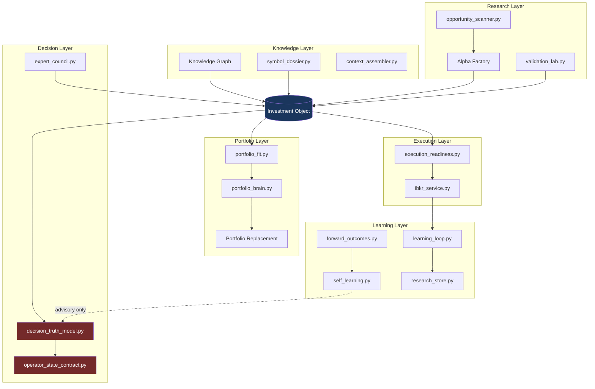

# CC X — Institutional Alpha OS Roadmap

**Document:** `docs/CC_X_INSTITUTIONAL_ALPHA_OS.md`  
**Product:** CC X (Clarity Console X) · `TradingAI_Bot`  
**Version baseline:** 9.0.0 (`src/core/version.py`)  
**Roadmap date:** 2026-08-25  
**Branch:** `cc/upgrade-regime-tracking`  
**Parent review:** [`CC_VNEXT_INSTITUTIONAL_MASTER_REVIEW.md`](./CC_VNEXT_INSTITUTIONAL_MASTER_REVIEW.md)  
**Authority contract:** [`CC_CONSOLIDATED_BRIEFING.md`](./CC_CONSOLIDATED_BRIEFING.md) §2

---

## Executive Alignment

### Strategic north star

The operator agrees with the institutional master review direction. The platform gap is **no longer "more indicators"** — it is a **compounding alpha platform**. Every module must answer one question:

> **Does this improve long-term portfolio alpha after cost and risk?**

CC X transforms CC from an unusually disciplined **Operator Decision OS** (score **7.0 / 10**) into an **Institutional Alpha OS** (target **9.5 / 10**) while preserving every authority contract. The competitive moat is not latency or sample size — it is **evidence + prioritization + governance** on a retail-accessible stack.

### Score path: 7.0 → 9.5

| Dimension               | Today (7.0 baseline) | CC X target (9.5) | Primary lever                                            |
| ----------------------- | -------------------: | ----------------: | -------------------------------------------------------- |
| Architecture            |                  6.5 |               9.0 | Investment Object + layer boundaries                     |
| Quant Intelligence      |                  6.5 |               9.0 | EV Ranking 3.0, Alpha Factory artifacts                  |
| ML / Learning           |              5.5–6.0 |               8.5 | Closed-trade loop, forward outcomes, advisory-only apply |
| Portfolio               |                  6.5 |               9.0 | Portfolio Brain, replacement, capital allocation         |
| Opportunity Discovery   |                  7.0 |               9.0 | Knowledge Graph + Opp Intel v3                           |
| Institutional Readiness |                  5.5 |               8.5 | Provenance, audit trail, export                          |
| Expected Alpha / ROI    |                  6.0 |               8.5 | Process alpha + ranked EV after costs                    |

**What moves the score:** Tier 1 systems (below) compound — each feeds the Investment Object, which feeds ranking, portfolio fit, and learning without bypassing gates.

### Commercial vision

**Positioning:** Bloomberg × Palantir × Notion × Renaissance × AI PM — for a disciplined operator pod ($500K–$10M AUM).

**Sell:** _The only AI investment OS that won't let you lie to yourself about deploy authority — and ranks every idea by expected value after cost, crowding, and portfolio impact._

**Competitive advantage:** Evidence lineage, EV-first prioritization, threshold governance, human deploy approval. **Not:** HFT, auto-trading, Terminal replacement, fake confidence.

---

## Non-Negotiable Constraints (Preserved)

All CC X work inherits the hard rules from the master review and consolidated briefing:

| Principle                 | Enforcement module                                       |
| ------------------------- | -------------------------------------------------------- |
| Page gate beats card rank | `operator_state_contract.py`, Guide checklist            |
| Research ≠ permission     | `surface_authority.py`, `authority: research_only`       |
| TRADE_RR_THRESHOLD = 2.5  | `decision_truth_model.py` — **no auto-loosen**           |
| EV after costs/risk       | `cost_adjusted_ranker.py`, `risk_limits.py`              |
| ML advisory only          | `ml_advisory_summary.py`, `self_learning.py` kill switch |
| Human deploy approval     | `deploy_open` + IBKR handoff ladder                      |
| Capacity downgrade-only   | `capacity_intelligence.py`, `signal_provenance.py`       |

**Explicit prohibitions:** auto-loosen thresholds; ML multiplier without sample floor (n≥30); synthetic flow as live; Discovery score implying deploy; screens without EV; auto rule changes from learning.

---

## Five Institutional Systems — Design & Codebase Map

### 1. Alpha Research OS

**Purpose:** End-to-end research production line — idea → evidence → validation → simulation → portfolio fit → execution → outcome → learning.

**Lifecycle stages and existing modules:**

| Stage              | Module(s)                                                                                 | Output                   | Gate                              |
| ------------------ | ----------------------------------------------------------------------------------------- | ------------------------ | --------------------------------- |
| Idea / edge source | `opportunity_scanner.py`, `scanner_matrix.py`, `signal_engine.py`                         | Ranked candidates + tags | `regime_router.py` selects engine |
| Evidence           | `context_assembler.py`, `symbol_dossier.py`, `insider_tracker.py`, `institutional_13f.py` | Name 360 envelope        | Provenance required               |
| Expected alpha     | `cost_adjusted_edge.py`, `cost_adjusted_ranker.py`                                        | Net edge bps             | Below floor → WATCH only          |
| Validation         | `validation_lab.py`, `backtest_lab.py`, `enhanced_backtester.py`                          | Walk-forward grade       | `research_only`                   |
| Simulation         | `rebalance_sim.py`, `scenario_engine.py`, `portfolio_brain.py`                            | What-if book             | No auto-trade                     |
| Portfolio fit      | `portfolio_fit.py`, `portfolio_decision_console.py`                                       | fit_score, concentration | Cannot override deploy gate       |
| Execution          | `execution_readiness.py`, `slippage_gate_service.py`, `ibkr_service.py`                   | Handoff readiness        | HARD blocks handoff               |
| Outcome            | `decision_persistence.py`, `learning_loop.py`, `closed_trades.jsonl`                      | Attribution record       | Partial — Sprint 118 closes       |
| Learning           | `self_learning.py`, `feature_ic.py`, `thompson_sizing.py`                                 | Advisory weight review   | Never auto-apply                  |

**Every idea must carry (Investment Object fields):** alpha source, factor exposures, expected alpha, duration, vol, crowding, capacity, liquidity, confidence, analogs, portfolio impact.

**New / extend:** Alpha Factory artifact writer → `data/artifacts/alpha_factory/{date}/{ticker}.json` (pattern: `artifacts/performance_artifact_writer.py`).

---

### 2. Market Knowledge Graph

**Purpose:** Connected market ontology — NVDA → AI → semis → power → … — enabling **graph search**, not just flat scanners.

**Current seeds (no graph engine yet):**

| Capability            | Module                                                | Status                    |
| --------------------- | ----------------------------------------------------- | ------------------------- |
| Sector classification | `sector_classifier.py`, `engines/correlation_risk.py` | Sector labels on names    |
| Theme / ETF tags      | `core/stock_universe.py` (`etf_theme_for`)            | Static theme map          |
| Sponsor / narrative   | `sponsor_index.py`, `crowding_narrative.py`           | Text narrative, not graph |
| Cross-asset           | `cross_asset_monitor.py`, `macro_regime_engine.py`    | Macro links               |
| Flow intelligence     | `flow_intelligence.py`, `options_flow_radar.py`       | Options chain context     |
| Dossier assembly      | `symbol_dossier.py`, `live_dossier.py`                | Single-name 360           |

**CC X target:**

```
Node types: Ticker, Sector, Theme, Factor, MacroDriver, Catalyst, Institution
Edge types: SUPPLIES_TO, COMPETES_WITH, THEME_MEMBER, FACTOR_LOAD, MACRO_SENSITIVE, OWNED_BY
Store: data/artifacts/knowledge_graph/graph.json + incremental edge log
API: GET /api/v7/graph/neighbors/{ticker}, GET /api/v7/graph/search?q=AI+power
UI: Dossier "Connected names" panel; Discovery theme clusters
```

**Authority:** Graph outputs are `research_only`; graph rank ≠ deploy permission.

---

### 3. Institutional Portfolio Brain

**Purpose:** Living book organism — answers _What do I own, what risk am I running, what becomes worse if I buy this?_

**Existing modules:**

| Capability         | Module                                     | Status                         |
| ------------------ | ------------------------------------------ | ------------------------------ |
| Book analytics     | `portfolio_decision_console.py`            | Strong operator copy           |
| Positions          | `portfolio_positions.py`                   | Manual + IBKR partial          |
| Risk cockpit       | `portfolio_risk_cockpit.py`                | Heat, stop breach              |
| Factor exposure    | `factor_exposure.py`                       | Mock stub — wire in Sprint 122 |
| Fit scoring        | `portfolio_fit.py`                         | Heuristic                      |
| Correlation        | `engines/correlation_risk.py`              | Sector buckets                 |
| Capacity aggregate | `capacity_intelligence.py`                 | Per-name; book rollup needed   |
| Drawdown           | `drawdown_sizer.py`, `drawdown_breaker.py` | Tested; partial UI wire        |
| Crisis             | `crisis_portfolio_survival.py`             | Regime stress                  |
| Archetype sim      | `portfolio_brain.py`                       | Neal-style policy objects      |
| Allocator          | `strategy_allocator.py`                    | Sleeve weights                 |
| Core/satellite     | `core_satellite.py`                        | Sleeve model                   |
| Replacement        | _new Sprint 124_                           | Fit-delta rank; human confirm  |

**Portfolio impact question:** Wire `portfolio_fit.py` + `correlation_risk.py` + theme overlap from Knowledge Graph into Investment Object `portfolio_impact` block.

---

### 4. Opportunity Ranking 3.0 (EV Formula)

**Purpose:** Single ranking function for monitor and research surfaces — **never overrides deploy gates**.

**Formula (display / sort / research priority):**

```
EV = alpha × prob × persistence × capacity × liquidity × fit × execution × macro × regime × factor
     − cost − crowding − decay
```

**Module mapping:**

| Term        | Source module                                               | Notes                  |
| ----------- | ----------------------------------------------------------- | ---------------------- |
| alpha       | `cost_adjusted_edge.py`                                     | Net bps after fees     |
| prob        | `EdgeModel` in `core/models.py`, `confidence_calibrator.py` | Sample-size labeled    |
| persistence | `leader_persistence.py`, `leader_tracking_service.py`       | Streak days            |
| capacity    | `capacity_intelligence.py`                                  | Downgrade-only         |
| liquidity   | `capacity_intelligence.py`, `slippage_gate_service.py`      | ADV participation      |
| fit         | `portfolio_fit.py`                                          | Book overlap           |
| execution   | `execution_readiness.py`                                    | Spread / participation |
| macro       | `macro_trend.py`, `index_regime.py`                         | Regime scalar          |
| regime      | `regime_router.py`, `market_regime_tracker.py`              | Engine tag alignment   |
| factor      | `factor_exposure.py`                                        | Live wire Sprint 122   |
| cost        | `cost_adjusted_ranker.py`                                   | Explicit subtraction   |
| crowding    | `crowding_narrative.py`, factor crowding                    | Research flag          |
| decay       | `feature_ic.py`, `strategy_curve_health.py`                 | Half-life sessions     |

**Implementation home:** Extend `cost_adjusted_ranker.py` → `ev_ranking.py` (Sprint 122); consume Investment Object; output `ev_score`, `ev_components`, `authority: research_only`.

---

### 5. Continuous Learning Platform

**Purpose:** Updates evidence across feature/factor/sector/macro/regime/execution/portfolio/drawdown — **never auto-changes rules**.

**Existing modules:**

| Component            | Path                                | Role                         |
| -------------------- | ----------------------------------- | ---------------------------- |
| Decision Journal     | `decision_persistence.py`           | JSONL append                 |
| Learning Loop        | `learning_loop.py`                  | Closed trades → MetaEnsemble |
| Self-Learning        | `self_learning.py`                  | min_sample=30; audit log     |
| Feature IC           | `feature_ic.py`                     | Decay alerts advisory        |
| Thompson Sizing      | `thompson_sizing.py`                | Arms from closed trades      |
| Threshold governance | `decision_truth_model.py`           | Static TRADE_RR_THRESHOLD    |
| Research memory      | `research_store.py`, `pm_memory.py` | PM notes + pipeline          |
| Trade memory         | `trade_memory_service.py`           | Per-ticker history           |
| Ops Alpha QA         | `ops_operator_console.py`           | Probe vs runtime             |

**CC X additions:** `forward_outcomes.py` (Sprint 118), Continuous Research Memory index linking artifacts → decisions → outcomes (Sprint 125).

---

## Investment Object — Canonical Schema

One **Investment Object** is consumed by Knowledge → Research → Decision → Portfolio → Execution → Learning layers. It **extends** (does not replace) `DecisionObject` (`engines/decision_object.py`) and aligns with `TradeBrief` / `EdgeModel` (`core/models.py`).

**Stub implementation:** `src/core/investment_object.py`

### Field summary

| Group                | Fields                                                                                                                         |
| -------------------- | ------------------------------------------------------------------------------------------------------------------------------ |
| **Identity**         | `investment_id`, `ticker`, `as_of`, `artifact_id`, `version`                                                                   |
| **Authority**        | `authority`, `may_authorize_deploy`, `deploy_eligible`, `gate_reasons[]`                                                       |
| **Provenance**       | `source`, `mode` (LIVE/DEGRADED/MOCK), `lag_days`, `data_freshness_minutes`                                                    |
| **Alpha thesis**     | `alpha_source`, `edge_hypothesis`, `setup_type`, `strategy_style`, `expected_alpha_bps`, `expected_holding_days`, `vol_bucket` |
| **Probability / EV** | `edge_model` (EdgeModel), `ev_score`, `ev_components{}`, `confidence`, `calibrated_confidence`                                 |
| **Factor / theme**   | `factor_exposures{}`, `theme_tags[]`, `sector`, `macro_sensitivity{}`                                                          |
| **Risk / liquidity** | `capacity_class`, `liquidity_score`, `crowding`, `half_life_sessions`, `decay_confidence`                                      |
| **Portfolio impact** | `portfolio_fit_score`, `sector_overlap_pct`, `correlation_note`, `replacement_delta`, `what_becomes_worse[]`                   |
| **Graph context**    | `graph_neighbors[]`, `theme_cluster_id`                                                                                        |
| **Analogs**          | `historical_analogs[]` (date, similarity, outcome_r)                                                                           |
| **Execution**        | `entry_zone`, `stop`, `target`, `rr_ratio`, `execution_quality`, `execution_cost_bps`                                          |
| **Lifecycle**        | `stage` (IDEA/VALIDATED/SIMULATED/FIT_CHECKED/GATED/DEPLOYED/CLOSED), `decision_id`, `outcome_r`                               |
| **Learning hooks**   | `regime_at_signal`, `feature_snapshot{}`, `journal_ref`                                                                        |

**Rule:** Only `decision_truth_model.py` + council + `operator_state_contract.py` may set `deploy_eligible=true`.

---

## Architecture

### Layer model

```
┌─────────────────────────────────────────────────────────────────────────┐
│                         CC X INSTITUTIONAL ALPHA OS                      │
├─────────────┬─────────────┬─────────────┬─────────────┬─────────────────┤
│  KNOWLEDGE  │  RESEARCH   │  DECISION   │  PORTFOLIO  │   EXECUTION     │
│  Graph      │  Alpha OS   │  Truth+Gate │  Brain      │   IBKR ladder   │
│  Dossier    │  Factory    │  Council    │  Fit/Replace│   Readiness     │
├─────────────┴─────────────┴──────┬──────┴─────────────┴─────────────────┤
│                         LEARNING (advisory only)                        │
│              forward outcomes · IC · Thompson · research memory          │
└─────────────────────────────────────────────────────────────────────────┘
                                    │
                    ┌───────────────▼───────────────┐
                    │     INVESTMENT OBJECT (SSOT)   │
                    │   src/core/investment_object   │
                    └───────────────▲───────────────┘
                                    │
        All modules READ/WRITE slices — none bypass authority
```

### Mermaid — layers + Investment Object flow



---

## Tier 1–3 Prioritization

### Tier 1 — Highest ROI (build first)

| #   | Initiative                     | Est. ROI                                         | Difficulty  | Key dependencies              | Primary files                                       |
| --- | ------------------------------ | ------------------------------------------------ | ----------- | ----------------------------- | --------------------------------------------------- |
| 1   | **Knowledge Graph**            | Fewer concentration errors; +20 min/day research | High        | `stock_universe`, sector data | _new_ `knowledge_graph.py`, `symbol_dossier.py`     |
| 2   | **Alpha Factory**              | Audit trail; research reproducibility            | Medium      | Sprint 115 payload            | `opportunity_scanner.py`, `artifacts/*`             |
| 3   | **Portfolio Optimizer**        | Better risk-adjusted book                        | Medium–High | Live factor wire              | `rebalance_sim.py`, `portfolio_brain.py`            |
| 4   | **EV Ranking 3.0**             | Correct priority on WAIT days                    | Medium      | Investment Object             | `cost_adjusted_ranker.py` → `ev_ranking.py`         |
| 5   | **Historical Analog Engine**   | Calibration; thesis validation                   | Medium      | Price history                 | _new_ `analog_engine.py`, dossier router            |
| 6   | **Trade Lifecycle Engine**     | Closed-loop attribution                          | Medium–High | IBKR fills                    | `learning_loop.py`, `decision_persistence.py`       |
| 7   | **Capital Allocation**         | Sleeve discipline                                | Medium      | `strategy_allocator.py`       | `strategy_allocator.py`, BDR strip                  |
| 8   | **Portfolio Replacement**      | Swap low-fit for high-fit                        | Medium      | Portfolio fit                 | `portfolio_fit.py`, `portfolio_decision_console.py` |
| 9   | **Macro Dependency**           | Regime-aware sizing                              | Low–Medium  | Regime stack                  | `macro_regime_engine.py`, `index_regime.py`         |
| 10  | **Continuous Research Memory** | Institutional recall                             | Medium      | Artifact store                | `research_store.py`, `pm_memory.py`                 |

**Combined Tier 1 estimate:** +0.5–1.2 Sharpe process improvement; **+$40–80K/yr** avoided errors + sizing calibration (single PM, $500K–$2M book).

---

### Tier 2 — Foundation & closure (Sprints 115–120)

| Initiative                   | ROI                       | Difficulty  | Modules                                      |
| ---------------------------- | ------------------------- | ----------- | -------------------------------------------- |
| Decision Board Unification   | +$15–40K/yr; zero drift   | Medium      | `decision_hub.py`, `bdr_operator_summary.py` |
| Data Provenance + CI         | Institutional credibility | Medium      | `market_data.py`, `brief_data_service.py`    |
| Playbook 10× + snapshots     | 30–45 min/day             | Medium      | `playbook.py`, snapshot JSON                 |
| Learning loop closure        | +$8–20K/yr                | Medium–High | `learning_loop.py`, scheduler                |
| Opportunity Intel v3 embed   | 20 min/day research       | Medium      | `opportunity_intelligence.py`, dossier       |
| E2E authority + export       | Regression safety         | Medium      | Playwright, board export                     |
| Forward outcomes service     | Brier calibration         | Medium      | _new_ `forward_outcomes.py`                  |
| Factor exposure live wire    | Remove mock on surfaces   | Medium      | `factor_exposure.py`                         |
| Command palette v0           | PM productivity           | Low–Medium  | `cc-app.js`                                  |
| Theme clustering (Discovery) | Graph precursor           | Medium      | scanner + graph                              |

---

### Tier 3 — Scale, polish, enterprise

| Initiative                                  | ROI             | Difficulty | Notes                       |
| ------------------------------------------- | --------------- | ---------- | --------------------------- |
| UI partial split (Today/Playbook/Portfolio) | Maintainability | Medium     | `build-cc-template.mjs`     |
| i18n completion                             | HK operator UX  | Medium     | `cc-i18n.js`                |
| Polling consolidation / SSE                 | API load −40%   | Medium     | `cc-app.js`, header payload |
| Horizontal scan fan-out                     | Scale           | High       | Redis, worker queue         |
| Enterprise RBAC / audit ledger              | Commercial      | High       | Not started                 |
| Multi-monitor detached panels               | PM UX           | Low        | UI only                     |
| ARCHITECTURE.md refresh                     | Onboarding      | Low        | Docs                        |

---

## CC X — Six Flagship Capabilities → Sprint Mapping

| #   | Flagship capability                  | Delivers                            | Primary sprints |
| --- | ------------------------------------ | ----------------------------------- | --------------- |
| 1   | **Knowledge Graph Intelligence**     | Theme/sector/macro connected search | 121, 119        |
| 2   | **Alpha Factory**                    | Per-candidate artifact pipeline     | 117, 121        |
| 3   | **Portfolio Intelligence**           | Brain + optimizer + replacement     | 122, 124        |
| 4   | **Opportunity Intelligence v3**      | Name 360 + EV + analogs             | 119, 122        |
| 5   | **Continuous Learning Engine**       | Outcomes → advisory review          | 118, 125        |
| 6   | **Institutional Research Workspace** | Graph + factory + memory UI         | 125, 120        |

---

## Sprint Plan: 115–125

Sprints 115–120 align with [`CC_VNEXT_INSTITUTIONAL_MASTER_REVIEW.md`](./CC_VNEXT_INSTITUTIONAL_MASTER_REVIEW.md) §14. Sprints 121–125 extend into CC X institutional systems.

### Sprint 115 — Decision Board Unification (P0)

| Field                  | Detail                                                                                                                                     |
| ---------------------- | ------------------------------------------------------------------------------------------------------------------------------------------ |
| **Headline**           | **One truth payload — zero deploy drift**                                                                                                  |
| **Objectives**         | `DecisionBoardService` shared by Today, Playbook, cc-header; identical `deploy_open`                                                       |
| **Expected alpha/ROI** | +$15–40K/yr avoided mismatch; 15 min/day reconciliation saved                                                                              |
| **Difficulty**         | Medium                                                                                                                                     |
| **Dependencies**       | `operator_state_contract.py`, `decision_hub.py`, `bdr_operator_summary.py`                                                                 |
| **Acceptance tests**   | WAIT/STALE/broker/fallback parametrize; three endpoints identical `system_state.deploy_open`; `test_dashboard_decision_integrity.py` green |
| **Investment Object**  | Board payload embeds `gate_snapshot` on each row                                                                                           |

---

### Sprint 116 — Data Provenance & CI Truth Gate (P0)

| Field                  | Detail                                                                                    |
| ---------------------- | ----------------------------------------------------------------------------------------- |
| **Headline**           | **Every price labeled — CI blocks authority regressions**                                 |
| **Objectives**         | Mandatory `source/as_of/mode` on market fields; Docker CI full pytest + `verify_10_10.sh` |
| **Expected alpha/ROI** | Institutional credibility; prevents silent data degradation                               |
| **Acceptance tests**   | STALE hides deploy CTAs; red CI on contract test failure                                  |
| **Investment Object**  | `ProvenanceBlock` populated on all IO instances                                           |

---

### Sprint 117 — Playbook 10× + Alpha Factory Artifacts (P1)

| Field                  | Detail                                                                            |
| ---------------------- | --------------------------------------------------------------------------------- |
| **Headline**           | **Sub-2s Playbook + auditable Alpha Factory artifacts**                           |
| **Objectives**         | Universal snapshot SWR; write `data/artifacts/alpha_factory/{date}/{ticker}.json` |
| **Expected alpha/ROI** | 30–45 min/day on scan days; research audit trail                                  |
| **Acceptance tests**   | k6 p95 <2s cached; stale banner; 100% top-12 rows have `artifact_id`              |

---

### Sprint 118 — Learning Loop Closure + Forward Outcomes (P1)

| Field                  | Detail                                                                                |
| ---------------------- | ------------------------------------------------------------------------------------- |
| **Headline**           | **IBKR fills → learning; T+1/T+5/T+20 marks without waiting for close**               |
| **Objectives**         | `closed_trades.jsonl` ≥95% capture; `forward_outcomes.py` nightly; Ops Alpha QA panel |
| **Expected alpha/ROI** | +$8–20K/yr sizing calibration; ML sample ≥30 in 90 days                               |
| **Acceptance tests**   | Sim fill appends JSONL; Thompson hidden n<5; self-learning kill switch default ON     |

---

### Sprint 119 — Opportunity Intelligence v3 + Dossier Embed (P1)

| Field                  | Detail                                                                                    |
| ---------------------- | ----------------------------------------------------------------------------------------- |
| **Headline**           | **Name 360 with insider/13F/events/capacity — research_only preserved**                   |
| **Objectives**         | v3 API; Dossier chips; Discovery bridge with `artifact_id`                                |
| **Expected alpha/ROI** | 20 min/day research; fewer concentration mistakes                                         |
| **Acceptance tests**   | Dossier coverage ≥80%; zero mock factor on deploy surfaces; `may_authorize_deploy: false` |

---

### Sprint 120 — E2E Authority + Institutional Export (P1)

| Field                  | Detail                                                                     |
| ---------------------- | -------------------------------------------------------------------------- |
| **Headline**           | **Playwright proves WAIT disables deploy; board export for advisors**      |
| **Objectives**         | E2E in CI; JSON/CSV snapshot with authority disclaimer; command palette v0 |
| **Expected alpha/ROI** | Regression safety; weekly PM review export                                 |
| **Acceptance tests**   | Playwright screenshot on failure; export footer disclaimer                 |

---

### Sprint 121 — Knowledge Graph MVP + Theme Clusters (P1)

| Field                  | Detail                                                                                                                |
| ---------------------- | --------------------------------------------------------------------------------------------------------------------- |
| **Headline**           | **NVDA→AI→semis graph search replaces flat scanner-only context**                                                     |
| **Objectives**         | `knowledge_graph.py` with Ticker/Theme/Sector nodes; Discovery theme clusters; Dossier neighbors panel                |
| **Expected alpha/ROI** | Thematic overlap detection; +15 min/day faster context                                                                |
| **Difficulty**         | High                                                                                                                  |
| **Dependencies**       | Sprint 117 artifacts, `stock_universe.py`                                                                             |
| **Acceptance tests**   | Graph API returns neighbors for 10 golden tickers; theme cluster on Discovery; `research_only` on all graph endpoints |

---

### Sprint 122 — EV Ranking 3.0 + Portfolio Brain Wire (P1)

| Field                  | Detail                                                                                                                               |
| ---------------------- | ------------------------------------------------------------------------------------------------------------------------------------ |
| **Headline**           | **Expected Value ranking — alpha after cost, crowding, decay, fit**                                                                  |
| **Objectives**         | `ev_ranking.py`; Investment Object consumed by ranker; live `factor_exposure` wire; portfolio impact block                           |
| **Expected alpha/ROI** | Better WAIT-day priority; reduced crowding losses                                                                                    |
| **Acceptance tests**   | EV components visible in Ops; rank order changes on cost/crowding; deploy gate unchanged; `test_quant_authority_boundaries.py` green |

---

### Sprint 123 — Historical Analog Engine (P2)

| Field                  | Detail                                                                                  |
| ---------------------- | --------------------------------------------------------------------------------------- |
| **Headline**           | **Pattern analogs with n, date range, outcome R — research tab only**                   |
| **Objectives**         | `analog_engine.py`; `GET /v3/analogs/{ticker}`; Dossier analog strip                    |
| **Expected alpha/ROI** | Thesis calibration; fewer narrative-only trades                                         |
| **Acceptance tests**   | Analog payload includes sample n ≥5 or `confidence: low`; never on Playbook deploy card |

---

### Sprint 124 — Portfolio Replacement + Capital Allocation (P2)

| Field                  | Detail                                                                                                          |
| ---------------------- | --------------------------------------------------------------------------------------------------------------- |
| **Headline**           | **"What becomes worse if I buy this?" — swap candidates, sleeve budgets**                                       |
| **Objectives**         | Replacement chip on Portfolio; fit-delta rank; `strategy_allocator` targets in BDR; sector cap blocks quick-add |
| **Expected alpha/ROI** | +$5–15K/yr from avoided concentration; cleaner sleeve discipline                                                |
| **Acceptance tests**   | Replacement requires human confirm; no auto-trade; sector cap UI block; `what_becomes_worse[]` on IO            |

---

### Sprint 125 — Continuous Research Memory + Institutional Workspace (P2)

| Field                  | Detail                                                                                                                                  |
| ---------------------- | --------------------------------------------------------------------------------------------------------------------------------------- |
| **Headline**           | **Every artifact, decision, and outcome linked — learning advises, never auto-applies**                                                 |
| **Objectives**         | Research Memory index (`artifact_id` → decision → outcome); Institutional Workspace tab (graph + factory + memory); Ops learning digest |
| **Expected alpha/ROI** | Institutional recall; faster post-mortems; path to 9.5 score                                                                            |
| **Acceptance tests**   | Memory search by ticker returns linked artifacts; self-learning apply rate 0 without Ops toggle; audit log complete                     |

---

## What NOT to Build (Anti-Patterns)

| Anti-pattern                        | Why forbidden                  | Alternative                               |
| ----------------------------------- | ------------------------------ | ----------------------------------------- |
| More screens without EV             | Busywork; no alpha compounding | EV Ranking 3.0 on every surface           |
| Auto-loosen gates after losses      | Capital destruction            | Threshold changelog + human review        |
| ML auto-apply weights               | Unaudited rule change          | Ops toggle + n≥30 + audit log             |
| Discovery deploy buttons            | Authority violation            | Research bridge + WATCH cap               |
| Mock factor on deploy cards         | False institutional confidence | `degraded=true` or hide                   |
| Graph rank → deploy                 | Card rank ≠ gate               | `may_authorize_deploy: false`             |
| Cache `deploy_open=true`            | Client/server drift            | Server-authoritative payload (Sprint 115) |
| Scanner-only theme exposure         | Misses hidden correlation      | Knowledge Graph                           |
| Generic "confidence" without sample | Fake precision                 | `EdgeModel.sample_size` + Thompson floor  |
| Renaissance cosplay (1000 factors)  | Sample-starved overfit         | Feature IC advisory + governance          |

---

## Migration Path — Current CC → CC X (No Broken Contracts)

### Phase A — Unify without renaming (Sprints 115–118)

1. **Decision payload SSOT** — no UI behavior change; eliminate drift.
2. **Provenance on all prices** — additive fields; STALE behavior unchanged.
3. **Alpha Factory artifacts** — write-only sidecar; Playbook rank logic unchanged.
4. **Learning closure** — IBKR → JSONL; learning remains advisory.

### Phase B — Investment Object introduction (Sprints 119–122)

1. Add `src/core/investment_object.py` (Pydantic).
2. Adapter: `DecisionObject` → `InvestmentObject` for new code paths only.
3. EV ranker reads IO; **legacy rank preserved as fallback** until parity tests pass.
4. All new fields default `authority=research_only`, `may_authorize_deploy=false`.

### Phase C — Institutional systems (Sprints 121–125)

1. Knowledge Graph + EV + analogs on research surfaces.
2. Portfolio Brain consumes IO `portfolio_impact`.
3. Research Memory indexes artifacts — no migration of historical JSONL required (append-only).

### Authority regression gates (every sprint)

- `tests/test_operator_state_contract.py`
- `tests/test_quant_authority_boundaries.py`
- `tests/test_vnext_truthful_surfaces.py`
- `scripts/verify_10_10.sh`

**Rollback rule:** Any sprint that fails authority cluster reverts IO consumer only — gates remain in `decision_truth_model.py` + `operator_state_contract.py`.

---

## Appendix — Module Index (CC X)

| Domain            | Primary modules                                                                      |
| ----------------- | ------------------------------------------------------------------------------------ |
| Investment Object | `src/core/investment_object.py`, `engines/decision_object.py`                        |
| Authority         | `operator_state_contract.py`, `decision_truth_model.py`, `surface_authority.py`      |
| Knowledge         | _new_ `knowledge_graph.py`, `symbol_dossier.py`, `context_assembler.py`              |
| Alpha Factory     | `opportunity_scanner.py`, `cost_adjusted_edge.py`, `artifacts/*`                     |
| EV Ranking        | `cost_adjusted_ranker.py`, _new_ `ev_ranking.py`                                     |
| Portfolio Brain   | `portfolio_brain.py`, `portfolio_decision_console.py`, `portfolio_fit.py`            |
| Learning          | `learning_loop.py`, `self_learning.py`, `feature_ic.py`, _new_ `forward_outcomes.py` |
| Opportunity v3    | `opportunity_intelligence.py`, `insider_tracker.py`, `capacity_intelligence.py`      |

---

## Relation to Prior Documents

This roadmap **operationalizes** the user's strategic vision and extends [`CC_VNEXT_INSTITUTIONAL_MASTER_REVIEW.md`](./CC_VNEXT_INSTITUTIONAL_MASTER_REVIEW.md) with CC X branding, Investment Object schema, Tier 1–3 prioritization, sprints 121–125, and explicit migration/anti-pattern guidance. Authority constraints are unchanged.

---

_End of CC X Institutional Alpha OS Roadmap._
