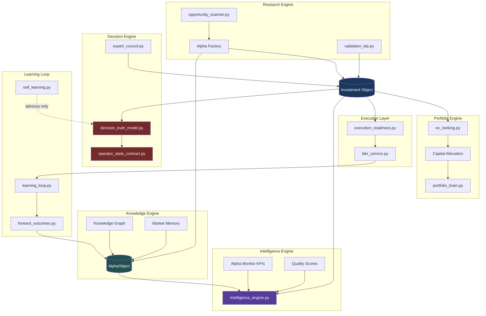

> **Redirect:** Architecture SSOT → [`CC_X_ARCHITECTURE.md`](./CC_X_ARCHITECTURE.md) · Backlog → [`CC_X_ENGINEERING_BACKLOG.md`](./CC_X_ENGINEERING_BACKLOG.md) · **Do not add new work here** — use the backlog.

# CC X — Institutional Alpha OS Roadmap

**Document:** `docs/CC_X_INSTITUTIONAL_ALPHA_OS.md`  
**Product:** CC X (Clarity Console X) · `TradingAI_Bot`  
**Version baseline:** 9.0.0 (`src/core/version.py`)  
**Roadmap date:** 2026-08-25  
**Branch:** `cc/upgrade-regime-tracking`  
**Parent review:** [`CC_VNEXT_INSTITUTIONAL_MASTER_REVIEW.md`](./CC_VNEXT_INSTITUTIONAL_MASTER_REVIEW.md)  
**Full institutional review:** [`CC_X_FULL_INSTITUTIONAL_REVIEW.md`](./CC_X_FULL_INSTITUTIONAL_REVIEW.md)  
**Authority contract:** [`CC_CONSOLIDATED_BRIEFING.md`](./CC_CONSOLIDATED_BRIEFING.md) §2

---

## Executive Alignment

### Strategic north star — investment-outcome-first

The operator agrees with the institutional master review direction and refines the roadmap from **engineering-first** to **investment-outcome-first**. The platform gap is **no longer "more indicators"** — it is a **compounding alpha platform** where **capital is the first-class citizen**, not signals.

Every module must answer:

> **Does this improve long-term portfolio alpha after cost and risk?**

CC X transforms CC from an unusually disciplined **Operator Decision OS** (score **7.0 / 10**) into an **Institutional Alpha OS** (target **9.5 / 10**) while preserving every authority contract. The competitive moat is not latency or sample size — it is **evidence + prioritization + governance + institutional memory** on a retail-accessible stack.

### Capital flow chain (design order)

Build and measure in this order — not feature-layer order:

```
Capital → Expected Alpha → Risk Budget → Portfolio Construction → Execution → Measured Alpha → Knowledge
```

| Stage                      | Question answered                                                       |
| -------------------------- | ----------------------------------------------------------------------- |
| **Capital**                | How much can we deploy? What is the marginal return on the next dollar? |
| **Expected Alpha**         | What alpha does this hypothesis produce after cost and crowding?        |
| **Risk Budget**            | Does this fit sleeve limits, drawdown, and concentration rules?         |
| **Portfolio Construction** | What to buy, what to sell first, what becomes worse?                    |
| **Execution**              | Can we get filled at acceptable slippage?                               |
| **Measured Alpha**         | What alpha was produced, lost, preserved, missed, deferred, learned?    |
| **Knowledge**              | Did the platform become smarter? What do we remember for next time?     |

### Competitive positioning

> **Bloomberg tells you what happened. Palantir tells you what is connected. Notion stores research. CC X remembers every hypothesis, measures every decision, governs every deployment, and continuously improves without compromising risk controls.**

**Sell:** _The only AI investment OS that won't let you lie to yourself about deploy authority — ranks every idea by expected value after cost, crowding, and portfolio impact, and remembers every hypothesis forever._

**Not:** HFT, auto-trading, Terminal replacement, fake confidence, trade-generator cosplay.

### Score path: 7.0 → 9.5

| Dimension               | Today (7.0 baseline) | CC X target (9.5) | Primary lever                                            |
| ----------------------- | -------------------: | ----------------: | -------------------------------------------------------- |
| Architecture            |                  6.5 |               9.0 | Investment Object + layer boundaries                     |
| Quant Intelligence      |                  6.5 |               9.0 | EV Ranking 3.0, Alpha Factory artifacts                  |
| ML / Learning           |              5.5–6.0 |               8.5 | Closed-trade loop, forward outcomes, advisory-only apply |
| Portfolio               |                  6.5 |               9.0 | Portfolio Brain, replacement, capital allocation         |
| Opportunity Discovery   |                  7.0 |               9.0 | Knowledge Graph + Opp Intel v3                           |
| Institutional Readiness |                  5.5 |               8.5 | Provenance, audit trail, export                          |
| Expected Alpha / ROI    |                  6.0 |               8.5 | Process alpha + ranked EV after costs                    |

**What moves the score:** Tier 1 systems (below) compound — each feeds the Investment Object, which feeds ranking, portfolio fit, and learning without bypassing gates.

### Internal organization — engines, not pages

Pages (Dashboard, Playbook, Discovery, Portfolio) are **views** of the same underlying model. Internal build order:

```
Capital → Knowledge → Research → Decision → Execution → Learning
```

Six **core engines** (not five) own the model; UI pages render slices:

| Engine                  | Role                                                    | Primary question                                           |
| ----------------------- | ------------------------------------------------------- | ---------------------------------------------------------- |
| **Knowledge Engine**    | Market memory, analogs, graph, AlphaObject archive      | "What did we learn last time this looked like March 2024?" |
| **Research Engine**     | Alpha Factory, evidence, validation                     | "Is the hypothesis supported?"                             |
| **Decision Engine**     | Truth model, gates, council                             | "May we deploy?"                                           |
| **Portfolio Engine**    | Book fit, replacement, capital allocation               | "Where should the next $10K go?"                           |
| **Execution Engine**    | Readiness, IBKR handoff, slippage                       | "Can we execute without destroying edge?"                  |
| **Intelligence Engine** | CEO dashboard for AI — platform IQ, not trade generator | "Did the platform become smarter today?"                   |

---

## Non-Negotiable Constraints (Preserved)

All CC X work inherits the hard rules from the master review and consolidated briefing:

| Principle                 | Enforcement module                                       |
| ------------------------- | -------------------------------------------------------- |
| Page gate beats card rank | `operator_state_contract.py`, Guide checklist            |
| Research ≠ permission     | `surface_authority.py`, `authority: research_only`       |
| TRADE_RR_THRESHOLD = 2.5  | `decision_truth_model.py` — **no auto-loosen**           |
| EV after costs/risk       | `cost_adjusted_ranker.py`, `risk_limits.py`              |
| ML advisory only          | `ml_advisory_summary.py`, `self_learning.py` kill switch |
| Human deploy approval     | `deploy_open` + IBKR handoff ladder                      |
| Capacity downgrade-only   | `capacity_intelligence.py`, `signal_provenance.py`       |

**Explicit prohibitions:** auto-loosen thresholds; ML multiplier without sample floor (n≥30); synthetic flow as live; Discovery score implying deploy; screens without EV; auto rule changes from learning.

---

## Six Core Engines — Design & Codebase Map

### 0. Intelligence Engine (CEO Dashboard for AI)

**Purpose:** Measure whether the **platform became smarter today** — not whether we made money today. This is **not** a trade generator.

**Daily question:** _Did the platform become smarter today?_

**Quality scores (proposed schema):**

| Score                 | What it measures                                             | Primary inputs                                           |
| --------------------- | ------------------------------------------------------------ | -------------------------------------------------------- |
| **Knowledge Score**   | Recall quality — analog hits, graph links, AlphaObject reuse | `AlphaObject`, `knowledge_graph.py`, market memory index |
| **Research Quality**  | Evidence depth, validation grade, sample size                | Alpha Factory artifacts, `validation_lab.py`             |
| **Decision Quality**  | Gate adherence, calibration, council alignment               | `decision_truth_model.py`, BDR, forward outcomes         |
| **Execution Quality** | Slippage vs plan, fill rate, cost vs budget                  | `execution_readiness.py`, `execution_analytics.py`       |
| **Portfolio Quality** | Fit, concentration, sleeve discipline, replacement hygiene   | `portfolio_fit.py`, `strategy_allocator.py`              |
| **Learning Quality**  | Closed-loop capture, lesson extraction, advisory review rate | `learning_loop.py`, `self_learning.py`                   |
| **Alpha Quality**     | Measured vs expected alpha; attribution completeness         | Alpha Monitor KPIs, attribution tree                     |

**Proposed payload (`IntelligenceDailyReport`):**

```json
{
	"as_of": "2026-08-25T16:00:00Z",
	"platform_smarter_today": true,
	"scores": {
		"knowledge": { "value": 72, "delta_1d": +3, "drivers": ["2 analog hits", "1 new AlphaObject lesson"] },
		"research": { "value": 68, "delta_1d": 0, "drivers": ["Alpha Factory n=12 artifacts"] },
		"decision": { "value": 81, "delta_1d": +1, "drivers": ["zero gate bypass incidents"] },
		"execution": { "value": 74, "delta_1d": -2, "drivers": ["slippage +8bps vs plan on 1 fill"] },
		"portfolio": { "value": 77, "delta_1d": +4, "drivers": ["sector cap respected", "replacement reviewed"] },
		"learning": { "value": 65, "delta_1d": +5, "drivers": ["3 forward outcomes marked", "1 post-mortem"] },
		"alpha": { "value": 70, "delta_1d": +2, "drivers": ["alpha_preserved > alpha_lost"] }
	},
	"authority": "research_only"
}
```

**Real-Time Alpha Monitor KPIs** (not signal counts):

| KPI                      | Definition                                               |
| ------------------------ | -------------------------------------------------------- |
| **Alpha Produced Today** | Realized edge from closed + marked positions (bps, R)    |
| **Alpha Lost**           | Edge destroyed by bad timing, slippage, or gate override |
| **Alpha Preserved**      | Edge kept by correct WAIT, trim, or exit                 |
| **Alpha Missed**         | Validated ideas not deployed due to capital/risk/gate    |
| **Alpha Deferred**       | Ideas queued for better entry or sleeve room             |
| **Alpha Learned**        | Lessons captured into AlphaObject / Knowledge Engine     |

**Implementation home:** _new_ `intelligence_engine.py` + Ops / CEO dashboard panel (Sprint 126). All outputs `authority: research_only`.

---

### 1. Knowledge Engine (Market Memory)

**Purpose:** CC remembers — not GPT. Persistent institutional memory for setup analogs, failure modes, and best exits.

**Market memory examples:**

- _"This setup looked like March 2024 and July 2025 — avg outcome +1.8R, failure mode: gap-down on earnings, best exit: trim at +2R."_
- Analog retrieval from `AlphaObject.lessons` + `historical_analogs` on Investment Object
- Full-text + graph search across prior hypotheses

**Alpha Attribution Tree** (institutional governance — full traceability):

```
PnL → Position → Decision → Research → Knowledge → Evidence → Market Data
```

Every PnL line must resolve upward through this chain for audit export. Stub refs: `AlphaObject.attribution_root_ref`, `InvestmentObject.decision_id`, Alpha Factory `artifact_id`.

**Store:** `data/artifacts/knowledge/` + AlphaObject index; API: `GET /api/v7/knowledge/analogs/{ticker}`, `GET /api/v7/attribution/{position_id}`.

**Knowledge Graph** (subset of Knowledge Engine):

```
Node types: Ticker, Sector, Theme, Factor, MacroDriver, Catalyst, Institution
Edge types: SUPPLIES_TO, COMPETES_WITH, THEME_MEMBER, FACTOR_LOAD, MACRO_SENSITIVE, OWNED_BY
Store: data/artifacts/knowledge_graph/graph.json + incremental edge log
API: GET /api/v7/graph/neighbors/{ticker}, GET /api/v7/graph/search?q=AI+power
```

| Capability            | Module                                                | Status                    |
| --------------------- | ----------------------------------------------------- | ------------------------- |
| Sector classification | `sector_classifier.py`, `engines/correlation_risk.py` | Sector labels on names    |
| Theme / ETF tags      | `core/stock_universe.py` (`etf_theme_for`)            | Static theme map          |
| Sponsor / narrative   | `sponsor_index.py`, `crowding_narrative.py`           | Text narrative, not graph |
| Cross-asset           | `cross_asset_monitor.py`, `macro_regime_engine.py`    | Macro links               |
| Flow intelligence     | `flow_intelligence.py`, `options_flow_radar.py`       | Options chain context     |
| Dossier assembly      | `symbol_dossier.py`, `live_dossier.py`                | Single-name 360           |

**Authority:** Graph and memory outputs are `research_only`; graph rank ≠ deploy permission.

---

### 2. Research Engine (Alpha Research OS)

**Purpose:** End-to-end research production line — idea → evidence → validation → simulation → portfolio fit → execution → outcome → learning.

**Lifecycle stages and existing modules:**

| Stage              | Module(s)                                                                                 | Output                   | Gate                              |
| ------------------ | ----------------------------------------------------------------------------------------- | ------------------------ | --------------------------------- |
| Idea / edge source | `opportunity_scanner.py`, `scanner_matrix.py`, `signal_engine.py`                         | Ranked candidates + tags | `regime_router.py` selects engine |
| Evidence           | `context_assembler.py`, `symbol_dossier.py`, `insider_tracker.py`, `institutional_13f.py` | Name 360 envelope        | Provenance required               |
| Expected alpha     | `cost_adjusted_edge.py`, `cost_adjusted_ranker.py`                                        | Net edge bps             | Below floor → WATCH only          |
| Validation         | `validation_lab.py`, `backtest_lab.py`, `enhanced_backtester.py`                          | Walk-forward grade       | `research_only`                   |
| Simulation         | `rebalance_sim.py`, `scenario_engine.py`, `portfolio_brain.py`                            | What-if book             | No auto-trade                     |
| Portfolio fit      | `portfolio_fit.py`, `portfolio_decision_console.py`                                       | fit_score, concentration | Cannot override deploy gate       |
| Execution          | `execution_readiness.py`, `slippage_gate_service.py`, `ibkr_service.py`                   | Handoff readiness        | HARD blocks handoff               |
| Outcome            | `decision_persistence.py`, `learning_loop.py`, `closed_trades.jsonl`                      | Attribution record       | Partial — Sprint 118 closes       |
| Learning           | `self_learning.py`, `feature_ic.py`, `thompson_sizing.py`                                 | Advisory weight review   | Never auto-apply                  |

**Every idea must carry (Investment Object fields):** alpha source, factor exposures, expected alpha, duration, vol, crowding, capacity, liquidity, confidence, analogs, portfolio impact.

**New / extend:** Alpha Factory artifact writer → `data/artifacts/alpha_factory/{date}/{ticker}.json` (pattern: `artifacts/performance_artifact_writer.py`).

---

### 3. Decision Engine

**Purpose:** Deploy authority, truth model, and council — the **only** layer that may set `deploy_eligible=true`.

**Core modules:**

| Capability        | Module                                       | Gate                                      |
| ----------------- | -------------------------------------------- | ----------------------------------------- |
| Truth model       | `decision_truth_model.py`                    | TRADE_RR_THRESHOLD = 2.5 — no auto-loosen |
| Page gate         | `operator_state_contract.py`                 | WAIT/NO_TRADE blocks deploy               |
| Council           | `expert_council.py`                          | Validates brief-sourced rows              |
| Surface authority | `surface_authority.py`                       | Research ≠ permission                     |
| Decision board    | `decision_hub.py`, `bdr_operator_summary.py` | Single truth payload (Sprint 115)         |

**Rule:** InvestmentObject flows in; only Decision Engine + council + operator contract may authorize deploy. AlphaObject never grants deploy.

---

### 4. Portfolio Engine (Brain + Capital Allocation)

**Purpose:** Living book organism — answers _What do I own, what risk am I running, what becomes worse if I buy this?_ plus **where capital should flow next**.

**Capital Allocation Engine** (beyond Portfolio Fit):

| Question                                            | Module direction                                        |
| --------------------------------------------------- | ------------------------------------------------------- |
| Where should the next $10K go?                      | `strategy_allocator.py` + EV rank + sleeve room         |
| What to sell first?                                 | Replacement rank + `what_becomes_worse[]`               |
| Highest marginal return on capital?                 | `marginal_return_on_capital` on AlphaObject / IO        |
| What increases expected alpha / decreases drawdown? | `portfolio_brain.py`, `rebalance_sim.py`, crisis stress |

**Existing modules:**

| Capability         | Module                                     | Status                         |
| ------------------ | ------------------------------------------ | ------------------------------ |
| Book analytics     | `portfolio_decision_console.py`            | Strong operator copy           |
| Positions          | `portfolio_positions.py`                   | Manual + IBKR partial          |
| Risk cockpit       | `portfolio_risk_cockpit.py`                | Heat, stop breach              |
| Factor exposure    | `factor_exposure.py`                       | Mock stub — wire in Sprint 122 |
| Fit scoring        | `portfolio_fit.py`                         | Heuristic                      |
| Correlation        | `engines/correlation_risk.py`              | Sector buckets                 |
| Capacity aggregate | `capacity_intelligence.py`                 | Per-name; book rollup needed   |
| Drawdown           | `drawdown_sizer.py`, `drawdown_breaker.py` | Tested; partial UI wire        |
| Crisis             | `crisis_portfolio_survival.py`             | Regime stress                  |
| Archetype sim      | `portfolio_brain.py`                       | Neal-style policy objects      |
| Allocator          | `strategy_allocator.py`                    | Sleeve weights                 |
| Core/satellite     | `core_satellite.py`                        | Sleeve model                   |
| Replacement        | _new Sprint 124_                           | Fit-delta rank; human confirm  |

**EV Ranking 3.0** (research priority — never overrides deploy gates):

```
EV = alpha × prob × persistence × capacity × liquidity × fit × execution × macro × regime × factor
     − cost − crowding − decay
```

Implementation: `cost_adjusted_ranker.py` → `ev_ranking.py` (Sprint 122); `authority: research_only`.

---

### 5. Execution Engine

**Purpose:** Handoff readiness, slippage governance, IBKR ladder — edge preserved or destroyed at the wire.

| Capability | Module                     | Gate                                   |
| ---------- | -------------------------- | -------------------------------------- |
| Readiness  | `execution_readiness.py`   | HARD blocks handoff                    |
| Slippage   | `slippage_gate_service.py` | Downgrade-only                         |
| Broker     | `ibkr_service.py`          | Human deploy approval                  |
| Analytics  | `execution_analytics.py`   | Fill vs plan → Execution Quality score |

**CC X additions:** Execution quality feeds Intelligence Engine daily scores; attribution tree links fills → decisions.

---

### 6. Learning Loop (feeds Intelligence + Knowledge)

**Purpose:** Updates evidence across feature/factor/sector/macro/regime/execution/portfolio/drawdown — **never auto-changes rules**. Outcomes flow into AlphaObject lessons and Intelligence Engine Learning Quality.

| Component            | Path                                | Role                         |
| -------------------- | ----------------------------------- | ---------------------------- |
| Decision Journal     | `decision_persistence.py`           | JSONL append                 |
| Learning Loop        | `learning_loop.py`                  | Closed trades → MetaEnsemble |
| Self-Learning        | `self_learning.py`                  | min_sample=30; audit log     |
| Feature IC           | `feature_ic.py`                     | Decay alerts advisory        |
| Thompson Sizing      | `thompson_sizing.py`                | Arms from closed trades      |
| Threshold governance | `decision_truth_model.py`           | Static TRADE_RR_THRESHOLD    |
| Research memory      | `research_store.py`, `pm_memory.py` | PM notes + pipeline          |
| Trade memory         | `trade_memory_service.py`           | Per-ticker history           |
| Ops Alpha QA         | `ops_operator_console.py`           | Probe vs runtime             |

**CC X additions:** `forward_outcomes.py` (Sprint 118), AlphaObject lifecycle close (Sprint 125), Intelligence daily report (Sprint 126).

---

## Investment Object — Canonical Schema

One **Investment Object** is consumed by Knowledge → Research → Decision → Portfolio → Execution → Learning layers. It **extends** (does not replace) `DecisionObject` (`engines/decision_object.py`) and aligns with `TradeBrief` / `EdgeModel` (`core/models.py`).

**Stub implementation:** `src/core/investment_object.py`

### Field summary

| Group                | Fields                                                                                                                         |
| -------------------- | ------------------------------------------------------------------------------------------------------------------------------ |
| **Identity**         | `investment_id`, `ticker`, `as_of`, `artifact_id`, `version`                                                                   |
| **Authority**        | `authority`, `may_authorize_deploy`, `deploy_eligible`, `gate_reasons[]`                                                       |
| **Provenance**       | `source`, `mode` (LIVE/DEGRADED/MOCK), `lag_days`, `data_freshness_minutes`                                                    |
| **Alpha thesis**     | `alpha_source`, `edge_hypothesis`, `setup_type`, `strategy_style`, `expected_alpha_bps`, `expected_holding_days`, `vol_bucket` |
| **Probability / EV** | `edge_model` (EdgeModel), `ev_score`, `ev_components{}`, `confidence`, `calibrated_confidence`                                 |
| **Factor / theme**   | `factor_exposures{}`, `theme_tags[]`, `sector`, `macro_sensitivity{}`                                                          |
| **Risk / liquidity** | `capacity_class`, `liquidity_score`, `crowding`, `half_life_sessions`, `decay_confidence`                                      |
| **Portfolio impact** | `portfolio_fit_score`, `sector_overlap_pct`, `correlation_note`, `replacement_delta`, `what_becomes_worse[]`                   |
| **Graph context**    | `graph_neighbors[]`, `theme_cluster_id`                                                                                        |
| **Analogs**          | `historical_analogs[]` (date, similarity, outcome_r)                                                                           |
| **Execution**        | `entry_zone`, `stop`, `target`, `rr_ratio`, `execution_quality`, `execution_cost_bps`                                          |
| **Lifecycle**        | `stage` (IDEA/VALIDATED/SIMULATED/FIT_CHECKED/GATED/DEPLOYED/CLOSED), `decision_id`, `outcome_r`                               |
| **Learning hooks**   | `regime_at_signal`, `feature_snapshot{}`, `journal_ref`                                                                        |

**Rule:** Only `decision_truth_model.py` + council + `operator_state_contract.py` may set `deploy_eligible=true`.

---

## AlphaObject — Institutional Memory Schema

**AlphaObject** survives forever as institutional memory. It links hypothesis → evidence → outcome → lessons for the Knowledge Engine.

| Object               | Layer     | Purpose                                                              |
| -------------------- | --------- | -------------------------------------------------------------------- |
| **InvestmentObject** | Decision  | Deploy gate, execution, portfolio impact — ephemeral to active trade |
| **AlphaObject**      | Knowledge | Hypothesis archive, evidence chain, lessons — permanent              |

**Stub implementation:** `src/core/alpha_object.py`

### Field summary

| Group          | Fields                                                                      |
| -------------- | --------------------------------------------------------------------------- |
| **Identity**   | `alpha_id`, `ticker`, `investment_id`, `as_of`, `version`, `stage`          |
| **Authority**  | `authority` (always `research_only`), `may_authorize_deploy` (always false) |
| **Thesis**     | `hypothesis`, `setup_type`, `expected_alpha_bps`, `expected_holding_days`   |
| **Evidence**   | `evidence[]` (source, summary, weight, supports_hypothesis)                 |
| **Confidence** | `confidence`, `calibrated_confidence`                                       |
| **Lifecycle**  | `updates[]`, `reviews[]`, `trades[]`                                        |
| **Portfolio**  | `portfolio_impact` (fit, marginal_return_on_capital, sell_first_candidates) |
| **Outcome**    | `final_outcome` (alpha_produced/lost/preserved/missed bps, verdict)         |
| **Learning**   | `lessons[]` (failure_mode, best_exit_note, analog_tags)                     |
| **Links**      | `knowledge_links[]`, `attribution_root_ref`, `market_data_refs[]`           |

**Lifecycle stages:** HYPOTHESIS → EVIDENCE_GATHERING → UNDER_REVIEW → ACTIVE → TRADED → CLOSED → ARCHIVED

**Rule:** AlphaObject never authorizes deploy. Linked InvestmentObject carries deploy authority only through Decision Engine.

---

## Institutional Research Workspace

**Not** a bigger Dossier — one workspace per investment with tabbed institutional views of the same underlying model:

| Tab            | Content source                                        |
| -------------- | ----------------------------------------------------- |
| **Business**   | Fundamentals, sponsor narrative, events               |
| **Technicals** | Price structure, setup type, entry/stop/target        |
| **Quant**      | EV components, factor loadings, validation grade      |
| **Macro**      | Regime sensitivity, cross-asset links                 |
| **Ownership**  | Insider, 13F, crowding                                |
| **Execution**  | Readiness, slippage history, fill quality             |
| **Portfolio**  | Fit score, replacement delta, capital allocation note |
| **Knowledge**  | AlphaObject, analogs, graph neighbors, market memory  |
| **History**    | Prior trades, journal entries, artifact timeline      |
| **Decision**   | Gate snapshot, council notes, deploy eligibility      |
| **Journal**    | PM notes, reviews, post-mortems                       |

All tabs read/write slices of InvestmentObject + AlphaObject; authority rules unchanged per tab.

---

## Architecture

### Layer model — six engines, one model

```
┌──────────────────────────────────────────────────────────────────────────────┐
│                    CC X INVESTMENT OUTCOME OS                                 │
├──────────┬──────────┬──────────┬──────────┬──────────┬───────────────────────┤
│KNOWLEDGE │ RESEARCH │ DECISION │PORTFOLIO │EXECUTION │  INTELLIGENCE (CEO)   │
│ Memory   │ Alpha OS │ Truth+   │ Brain +  │ IBKR     │  Platform IQ scores   │
│ Graph    │ Factory  │ Gate     │ Capital  │ Ladder   │  Alpha Monitor KPIs   │
├──────────┴──────────┴────┬─────┴──────────┴──────────┴───────────────────────┤
│                         LEARNING → Knowledge + Intelligence                   │
└──────────────────────────────────────────────────────────────────────────────┘
                                    │
              ┌─────────────────────▼─────────────────────┐
              │  INVESTMENT OBJECT (Decision layer SSOT) │
              │  src/core/investment_object.py           │
              └─────────────────────▲─────────────────────┘
                                    │
              ┌─────────────────────┴─────────────────────┐
              │  ALPHA OBJECT (Knowledge layer — forever)  │
              │  src/core/alpha_object.py                  │
              └────────────────────────────────────────────┘

Capital → Expected Alpha → Risk Budget → Portfolio → Execution → Measured Alpha → Knowledge
Pages (Dashboard, Playbook, Discovery, Portfolio) = views of same model
```

### Mermaid — layers + Investment Object flow



---

## Tier 1–3 Prioritization

### Tier 1 — Highest ROI (investment-outcome-first)

| #   | Initiative                     | Est. ROI                                       | Difficulty  | Key dependencies             | Primary files                                       |
| --- | ------------------------------ | ---------------------------------------------- | ----------- | ---------------------------- | --------------------------------------------------- |
| 1   | **Capital Allocation Engine**  | Optimal next-dollar deployment; −concentration | Medium–High | Portfolio fit, EV rank       | `strategy_allocator.py`, `portfolio_brain.py`       |
| 2   | **Real-Time Alpha Monitor**    | Measured alpha vs signal counts                | Medium      | Closed trades, forward marks | _new_ `alpha_monitor.py`, Ops panel                 |
| 3   | **Alpha Attribution Tree**     | Institutional audit; full PnL traceability     | Medium–High | Decision + artifact linkage  | _new_ `attribution_tree.py`, AlphaObject            |
| 4   | **AlphaObject Lifecycle**      | Permanent institutional memory                 | Medium      | Alpha Factory, learning loop | `src/core/alpha_object.py`, knowledge index         |
| 5   | **Intelligence Engine**        | Platform IQ — smarter-today metric             | Medium      | All quality score inputs     | _new_ `intelligence_engine.py`                      |
| 6   | **Knowledge Engine / Memory**  | Analog recall; CC remembers not GPT            | High        | Price history, AlphaObject   | _new_ `knowledge_graph.py`, `analog_engine.py`      |
| 7   | **Institutional Workspace**    | One investment, eleven tabs                    | Medium–High | IO + AlphaObject             | Dossier → workspace shell                           |
| 8   | **EV Ranking 3.0**             | Capital-prioritized research queue             | Medium      | Investment Object            | `cost_adjusted_ranker.py` → `ev_ranking.py`         |
| 9   | **Portfolio Replacement**      | Sell-first + marginal return on capital        | Medium      | Portfolio fit                | `portfolio_fit.py`, `portfolio_decision_console.py` |
| 10  | **Decision Board Unification** | Zero deploy drift; capital truth SSOT          | Medium      | Authority contracts          | `decision_hub.py`, Sprint 115                       |

**Combined Tier 1 estimate:** +0.5–1.2 Sharpe process improvement; **+$40–80K/yr** avoided errors + sizing calibration (single PM, $500K–$2M book).

---

### Tier 2 — Foundation & closure (Sprints 115–120)

| Initiative                   | ROI                       | Difficulty  | Modules                                      |
| ---------------------------- | ------------------------- | ----------- | -------------------------------------------- |
| Decision Board Unification   | +$15–40K/yr; zero drift   | Medium      | `decision_hub.py`, `bdr_operator_summary.py` |
| Data Provenance + CI         | Institutional credibility | Medium      | `market_data.py`, `brief_data_service.py`    |
| Playbook 10× + snapshots     | 30–45 min/day             | Medium      | `playbook.py`, snapshot JSON                 |
| Learning loop closure        | +$8–20K/yr                | Medium–High | `learning_loop.py`, scheduler                |
| Opportunity Intel v3 embed   | 20 min/day research       | Medium      | `opportunity_intelligence.py`, dossier       |
| E2E authority + export       | Regression safety         | Medium      | Playwright, board export                     |
| Forward outcomes service     | Brier calibration         | Medium      | _new_ `forward_outcomes.py`                  |
| Factor exposure live wire    | Remove mock on surfaces   | Medium      | `factor_exposure.py`                         |
| Command palette v0           | PM productivity           | Low–Medium  | `cc-app.js`                                  |
| Theme clustering (Discovery) | Graph precursor           | Medium      | scanner + graph                              |

---

### Tier 3 — Scale, polish, enterprise

| Initiative                                  | ROI             | Difficulty | Notes                       |
| ------------------------------------------- | --------------- | ---------- | --------------------------- |
| UI partial split (Today/Playbook/Portfolio) | Maintainability | Medium     | `build-cc-template.mjs`     |
| i18n completion                             | HK operator UX  | Medium     | `cc-i18n.js`                |
| Polling consolidation / SSE                 | API load −40%   | Medium     | `cc-app.js`, header payload |
| Horizontal scan fan-out                     | Scale           | High       | Redis, worker queue         |
| Enterprise RBAC / audit ledger              | Commercial      | High       | Not started                 |
| Multi-monitor detached panels               | PM UX           | Low        | UI only                     |
| ARCHITECTURE.md refresh                     | Onboarding      | Low        | Docs                        |

---

## CC X — Six Flagship Capabilities → Sprint Mapping

| #   | Flagship capability                  | Delivers                            | Primary sprints |
| --- | ------------------------------------ | ----------------------------------- | --------------- |
| 1   | **Intelligence Engine**              | CEO dashboard; platform IQ scores   | 126             |
| 2   | **Real-Time Alpha Monitor**          | Produced/Lost/Preserved/Missed KPIs | 118, 126        |
| 3   | **Alpha Attribution Tree**           | PnL → Market Data full traceability | 115, 120, 125   |
| 4   | **Capital Allocation Engine**        | Next $10K, sell-first, marginal ROC | 122, 124        |
| 5   | **AlphaObject + Knowledge Memory**   | CC remembers every hypothesis       | 117, 121, 125   |
| 6   | **Institutional Research Workspace** | Eleven-tab workspace per investment | 119, 125        |

---

## Sprint Plan: 115–126 (Investment-Outcome-First)

Sprints prioritize **capital → measured alpha → knowledge** over engineering convenience. Sprints 115–120 align with [`CC_VNEXT_INSTITUTIONAL_MASTER_REVIEW.md`](./CC_VNEXT_INSTITUTIONAL_MASTER_REVIEW.md) §14, re-framed. Sprints 121–126 extend CC X institutional systems.

### Sprint 115 — Capital-First Decision Board + Attribution Root (P0)

| Field                  | Detail                                                                                                                             |
| ---------------------- | ---------------------------------------------------------------------------------------------------------------------------------- |
| **Headline**           | **Capital truth first — one board, zero deploy drift, attribution root wired**                                                     |
| **Objectives**         | `DecisionBoardService` shared by Today, Playbook, cc-header; identical `deploy_open`; each row carries `attribution_root_ref` stub |
| **Expected alpha/ROI** | +$15–40K/yr avoided mismatch; capital visibility on every decision row                                                             |
| **Difficulty**         | Medium                                                                                                                             |
| **Dependencies**       | `operator_state_contract.py`, `decision_hub.py`, `bdr_operator_summary.py`                                                         |
| **Acceptance tests**   | WAIT/STALE/broker/fallback parametrize; three endpoints identical `system_state.deploy_open`; attribution ref on board rows        |
| **Investment Object**  | Board payload embeds `gate_snapshot` + `decision_id` for attribution chain                                                         |

---

### Sprint 116 — Evidence Lineage Gate + Alpha Provenance (P0)

| Field                  | Detail                                                                                    |
| ---------------------- | ----------------------------------------------------------------------------------------- |
| **Headline**           | **Market Data → Evidence chain — CI blocks authority regressions**                        |
| **Objectives**         | Mandatory `source/as_of/mode` on all market fields; provenance feeds AlphaObject evidence |
| **Expected alpha/ROI** | Institutional credibility; attribution tree leaf nodes labeled                            |
| **Acceptance tests**   | STALE hides deploy CTAs; red CI on contract test failure; evidence block on AlphaObject   |
| **AlphaObject**        | `AlphaEvidence` populated from provenance-envelope fields                                 |

---

### Sprint 117 — Alpha Factory + AlphaObject Birth (P1)

| Field                  | Detail                                                                              |
| ---------------------- | ----------------------------------------------------------------------------------- |
| **Headline**           | **Every candidate gets an AlphaObject — auditable hypothesis from day one**         |
| **Objectives**         | Alpha Factory writes artifact + spawns `AlphaObject`; Playbook snapshot SWR p95 <2s |
| **Expected alpha/ROI** | 30–45 min/day on scan days; institutional memory begins at hypothesis               |
| **Acceptance tests**   | 100% top-12 rows have `artifact_id` + `alpha_id`; stale banner; research_only       |

---

### Sprint 118 — Real-Time Alpha Monitor + Forward Outcomes (P1)

| Field                  | Detail                                                                               |
| ---------------------- | ------------------------------------------------------------------------------------ |
| **Headline**           | **Alpha Produced/Lost/Preserved today — not signal counts**                          |
| **Objectives**         | `alpha_monitor.py` daily KPIs; `forward_outcomes.py` T+1/T+5/T+20; IBKR → JSONL ≥95% |
| **Expected alpha/ROI** | +$8–20K/yr sizing calibration; measured alpha visibility                             |
| **Acceptance tests**   | Six KPIs visible in Ops; Thompson hidden n<5; self-learning kill switch default ON   |
| **AlphaObject**        | `final_outcome` interim marks on open hypotheses                                     |

---

### Sprint 119 — Institutional Research Workspace MVP (P1)

| Field                  | Detail                                                                                                                     |
| ---------------------- | -------------------------------------------------------------------------------------------------------------------------- |
| **Headline**           | **One investment, eleven tabs — workspace not bigger Dossier**                                                             |
| **Objectives**         | Workspace shell with Business/Technicals/Quant/Macro/Ownership/Execution/Portfolio/Knowledge/History/Decision/Journal tabs |
| **Expected alpha/ROI** | 20 min/day research; unified view of IO + AlphaObject                                                                      |
| **Acceptance tests**   | All tabs `research_only` except Decision (gate snapshot); zero mock on deploy surfaces                                     |

---

### Sprint 120 — Alpha Attribution Tree E2E + Institutional Export (P1)

| Field                  | Detail                                                                |
| ---------------------- | --------------------------------------------------------------------- |
| **Headline**           | **PnL → Market Data traceability — Playwright + audit export**        |
| **Objectives**         | `attribution_tree.py` resolves full chain; E2E in CI; JSON/CSV export |
| **Expected alpha/ROI** | Regression safety; institutional governance for advisors              |
| **Acceptance tests**   | Golden position resolves 7-level chain; export footer disclaimer      |

---

### Sprint 121 — Knowledge Engine + Market Memory (P1)

| Field                  | Detail                                                                                      |
| ---------------------- | ------------------------------------------------------------------------------------------- |
| **Headline**           | **CC remembers — "looked like March 2024" with avg outcome and failure modes**              |
| **Objectives**         | `knowledge_graph.py` MVP; `analog_engine.py`; AlphaObject `lessons[]` with analog_tags      |
| **Expected alpha/ROI** | Thesis calibration; institutional recall without GPT                                        |
| **Acceptance tests**   | Analog API returns n ≥5 or `confidence: low`; market memory search by ticker; research_only |

---

### Sprint 122 — Capital Allocation Engine + EV Ranking 3.0 (P1)

| Field                  | Detail                                                                                                      |
| ---------------------- | ----------------------------------------------------------------------------------------------------------- |
| **Headline**           | **Where next $10K goes — marginal return on capital ranked after cost and fit**                             |
| **Objectives**         | Capital Allocation panel; `ev_ranking.py`; live factor wire; `marginal_return_on_capital` on IO/AlphaObject |
| **Expected alpha/ROI** | Better capital deployment; reduced crowding losses                                                          |
| **Acceptance tests**   | Sell-first candidates ranked; EV components visible; deploy gate unchanged                                  |

---

### Sprint 123 — Historical Analog Engine + Pattern Library (P2)

| Field                  | Detail                                                                                  |
| ---------------------- | --------------------------------------------------------------------------------------- |
| **Headline**           | **Pattern library with n, date range, outcome R — Knowledge tab only**                  |
| **Objectives**         | Enriched analogs; failure_mode + best_exit on AlphaObject lessons                       |
| **Expected alpha/ROI** | Fewer narrative-only trades; faster post-mortems                                        |
| **Acceptance tests**   | Analog payload includes sample n ≥5 or `confidence: low`; never on Playbook deploy card |

---

### Sprint 124 — Portfolio Replacement + Sell-First Logic (P2)

| Field                  | Detail                                                                                  |
| ---------------------- | --------------------------------------------------------------------------------------- |
| **Headline**           | **What to sell first — swap candidates ranked by fit-delta and marginal ROC**           |
| **Objectives**         | Replacement chip; `sell_first_candidates[]` on AlphaObject; sector cap blocks quick-add |
| **Expected alpha/ROI** | +$5–15K/yr from avoided concentration; cleaner sleeve discipline                        |
| **Acceptance tests**   | Replacement requires human confirm; no auto-trade; `what_becomes_worse[]` on IO         |

---

### Sprint 125 — AlphaObject Lifecycle Close + Research Memory (P2)

| Field                  | Detail                                                                                                   |
| ---------------------- | -------------------------------------------------------------------------------------------------------- |
| **Headline**           | **Hypothesis → outcome → lesson — AlphaObject archived, never deleted**                                  |
| **Objectives**         | Lifecycle close flow; Research Memory index (`alpha_id` → decision → outcome); attribution tree complete |
| **Expected alpha/ROI** | Institutional recall; faster post-mortems; path to 9.5 score                                             |
| **Acceptance tests**   | Closed hypotheses have `final_outcome` + `lessons[]`; self-learning apply rate 0 without Ops toggle      |

---

### Sprint 126 — Intelligence Engine CEO Dashboard (P2)

| Field                  | Detail                                                                                                                                     |
| ---------------------- | ------------------------------------------------------------------------------------------------------------------------------------------ |
| **Headline**           | **Did the platform become smarter today? — seven quality scores + platform_smarter_today**                                                 |
| **Objectives**         | `intelligence_engine.py`; daily `IntelligenceDailyReport`; Ops CEO panel; Alpha Monitor rollup                                             |
| **Expected alpha/ROI** | Process alpha visibility; operator confidence in platform improvement                                                                      |
| **Acceptance tests**   | All seven scores computed; `platform_smarter_today` boolean; `authority: research_only`; no trade recommendations from Intelligence Engine |

## What NOT to Build (Anti-Patterns)

| Anti-pattern                        | Why forbidden                  | Alternative                               |
| ----------------------------------- | ------------------------------ | ----------------------------------------- |
| More screens without EV             | Busywork; no alpha compounding | EV Ranking 3.0 on every surface           |
| Auto-loosen gates after losses      | Capital destruction            | Threshold changelog + human review        |
| ML auto-apply weights               | Unaudited rule change          | Ops toggle + n≥30 + audit log             |
| Discovery deploy buttons            | Authority violation            | Research bridge + WATCH cap               |
| Mock factor on deploy cards         | False institutional confidence | `degraded=true` or hide                   |
| Graph rank → deploy                 | Card rank ≠ gate               | `may_authorize_deploy: false`             |
| Cache `deploy_open=true`            | Client/server drift            | Server-authoritative payload (Sprint 115) |
| Scanner-only theme exposure         | Misses hidden correlation      | Knowledge Graph                           |
| Generic "confidence" without sample | Fake precision                 | `EdgeModel.sample_size` + Thompson floor  |
| Renaissance cosplay (1000 factors)  | Sample-starved overfit         | Feature IC advisory + governance          |

---

## Migration Path — Current CC → CC X (No Broken Contracts)

### Phase A — Unify without renaming (Sprints 115–118)

1. **Decision payload SSOT** — no UI behavior change; eliminate drift.
2. **Provenance on all prices** — additive fields; STALE behavior unchanged.
3. **Alpha Factory artifacts** — write-only sidecar; Playbook rank logic unchanged.
4. **Learning closure** — IBKR → JSONL; learning remains advisory.

### Phase B — Investment Object introduction (Sprints 119–122)

1. Add `src/core/investment_object.py` (Pydantic).
2. Adapter: `DecisionObject` → `InvestmentObject` for new code paths only.
3. EV ranker reads IO; **legacy rank preserved as fallback** until parity tests pass.
4. All new fields default `authority=research_only`, `may_authorize_deploy=false`.

### Phase C — Institutional systems (Sprints 121–126)

1. Knowledge Engine + Market Memory + AlphaObject lifecycle.
2. Capital Allocation Engine + Intelligence Engine CEO dashboard.
3. Alpha Attribution Tree complete; Research Workspace eleven tabs.
4. Research Memory indexes AlphaObjects — append-only, never delete.

### Authority regression gates (every sprint)

- `tests/test_operator_state_contract.py`
- `tests/test_quant_authority_boundaries.py`
- `tests/test_vnext_truthful_surfaces.py`
- `scripts/verify_10_10.sh`

**Rollback rule:** Any sprint that fails authority cluster reverts IO consumer only — gates remain in `decision_truth_model.py` + `operator_state_contract.py`.

---

## Appendix — Module Index (CC X)

| Domain             | Primary modules                                                                      |
| ------------------ | ------------------------------------------------------------------------------------ |
| Investment Object  | `src/core/investment_object.py`, `engines/decision_object.py`                        |
| Alpha Object       | `src/core/alpha_object.py`                                                           |
| Intelligence       | _new_ `intelligence_engine.py`, _new_ `alpha_monitor.py`                             |
| Attribution        | _new_ `attribution_tree.py`                                                          |
| Authority          | `operator_state_contract.py`, `decision_truth_model.py`, `surface_authority.py`      |
| Knowledge          | _new_ `knowledge_graph.py`, `symbol_dossier.py`, _new_ `analog_engine.py`            |
| Alpha Factory      | `opportunity_scanner.py`, `cost_adjusted_edge.py`, `artifacts/*`                     |
| EV Ranking         | `cost_adjusted_ranker.py`, _new_ `ev_ranking.py`                                     |
| Portfolio Brain    | `portfolio_brain.py`, `portfolio_decision_console.py`, `portfolio_fit.py`            |
| Capital Allocation | `strategy_allocator.py`, `core_satellite.py`                                         |
| Learning           | `learning_loop.py`, `self_learning.py`, `feature_ic.py`, _new_ `forward_outcomes.py` |
| Workspace          | Institutional Research Workspace (eleven tabs)                                       |

---

## Relation to Prior Documents

This roadmap **operationalizes** the user's **investment-outcome-first** strategic refinement (2026-08-25) and extends [`CC_VNEXT_INSTITUTIONAL_MASTER_REVIEW.md`](./CC_VNEXT_INSTITUTIONAL_MASTER_REVIEW.md) with:

- Six core engines (including **Intelligence Engine** — CEO dashboard for platform IQ, not trade generation)
- **AlphaObject** institutional memory schema (`src/core/alpha_object.py`)
- **Alpha Attribution Tree:** PnL → Position → Decision → Research → Knowledge → Evidence → Market Data
- **Capital Allocation Engine** beyond portfolio fit
- **Real-Time Alpha Monitor** KPIs (Produced / Lost / Preserved / Missed / Deferred / Learned)
- **Institutional Research Workspace** (eleven tabs per investment)
- Sprints **115–126** re-prioritized investment-outcome-first

Authority constraints from [`CC_CONSOLIDATED_BRIEFING.md`](./CC_CONSOLIDATED_BRIEFING.md) §2 are unchanged.

---

_End of CC X Institutional Alpha OS Roadmap (Investment-Outcome-First v2)._
