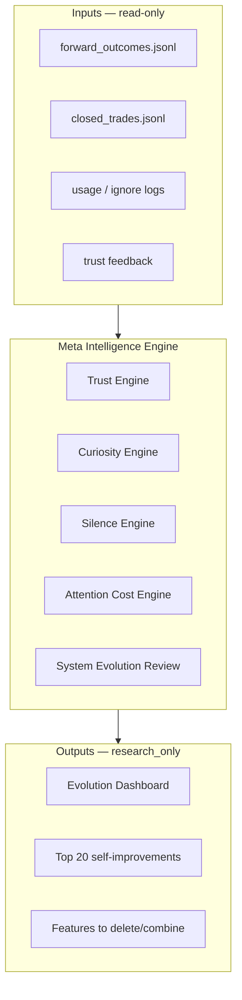

# CC X — Meta Intelligence Engine (v15)

**Product:** CC X · `TradingAI_Bot`  
**Last updated:** 2026-08-25 (Phase A `59db29f` · Phase B stubs · ADR-022 IDOS)  
**Status:** Design + Phase 1 partial (forward outcomes done; belief stub; MIE telemetry todo)  
**Architecture:** [`CC_X_ARCHITECTURE.md`](./CC_X_ARCHITECTURE.md)  
**Backlog:** [`CC_X_ENGINEERING_BACKLOG.md`](./CC_X_ENGINEERING_BACKLOG.md)  
**Governance:** [`CC_X_INVESTMENT_COMMITTEE_RESOLUTION.md`](./CC_X_INVESTMENT_COMMITTEE_RESOLUTION.md)

> The Meta Intelligence Engine (MIE) is the monthly **system evolution review** layer. It never grants deploy authority. All outputs are `research_only` unless explicitly promoted through human CIO review.

**Reframe (ADR-022):** Instead of "which engine improved?" ask **which question became easier to answer** — Q1 Know, Q2 Believe, Q3 Doubt, Q4 Act.

---

## Ultimate purpose

**Help the operator compound measured alpha with fewer false positives, less cognitive load, and honest calibration — without ever replacing human deployment authority.**

---

## Constitutional constraints (non-negotiable)

| Rule | Implication for MIE |
|------|---------------------|
| Research ≠ deploy | MIE outputs cannot set `deploy_open` |
| Page Gate > Card Rank | Evolution suggestions must not bypass Decision Engine |
| Fail closed | Missing data → WAIT posture in any surfaced summary |
| Human authority permanent | MIE recommends; operator decides |

---

## Engine map



### Trust Engine
Tracks calibration drift (Brier, ECE), operator override rates, and surface-level trust decay. Feeds Belief Review and monthly CIO packet.

### Curiosity Engine
Surfaces **unexplored** monitor candidates, regime gaps, and scanner blind spots. Never promotes to deploy — only expands research queue.

### Silence Engine
Detects alert fatigue, redundant polls, duplicate banners, and low-signal UI noise. Proposes **removals** and default-collapsed panels (e.g. WAIT-day rank hero demotion).

### Attention Cost Engine
Scores operator time spent per surface vs decision value produced. Inputs: usage/ignore logging (Phase 1), session dwell proxies (Phase 2).

### System Evolution Review (monthly)
Aggregates the four engines + v14 compounding loops into one CIO-readable report scored by **question lift** (not engine lift):

- Which surfaces made **Q1 Know** easier? (provenance, freshness, facts)
- Which made **Q2 Believe** easier? (thesis, conviction, calibration)
- Which made **Q3 Doubt** easier? (unknowns surfaced, assumptions challenged)
- Which made **Q4 Act** easier? (deploy/wait/monitor clarity)
- What to delete or combine (Silence Engine — features that obscured questions)
- Belief updates due

---

## Monthly review (Four Questions format)

Example System Evolution Review packet:

```
TODAY — Monthly Evolution · August 2026

We know ...
  Forward outcomes T+20 on 12 closes; regime WAIT 18/22 days; provenance on 78% of prices (↑ from 62%).

We believe ...
  Marginal ROC ladder correctly ranked cash > deploy on 9/12 WAIT days; belief review stub linked to forward outcomes.

We don't know ...
  Calibration on conviction vs size (CCX-135 open); attention cost per surface (CCX-132 todo); Discovery browse still confuses rank with deploy permission.

Therefore ...
  KEEP: Mission Brief + WAIT collapse (Q3+Q4 lift). EXTEND: Belief Review full items (Q2+Q3). DELETE: rank hero prominence on WAIT days (Q4 harm). One improvement approved: CCX-135.
```

Score each candidate change:

| Surface / change | Q1 | Q2 | Q3 | Q4 | Verdict |
|------------------|----|----|----|----|---------|
| Mission Brief bilingual | ↑ | — | ↑ | ↑ | Keep |
| Shared opportunity pipeline | ↑ | ↑ | — | ↑ | Keep |
| Rank hero on WAIT days | — | ↓ | — | ↓ | Delete |
| Belief Review stub | — | ↑ | ↑ | — | Extend |

---

## v14 Alpha Compounding loops (feeds MIE)

| Loop | Cadence | Artifact |
|------|---------|----------|
| Trade close → forward outcomes | T+0 on close; T+1/5/20 scheduler | `forward_outcomes.jsonl` |
| Belief Review | Monthly | `/api/v7/belief-review/summary` (stub) |
| Weekly CIO Review | Weekly | Ops digest (todo) |
| Monthly Evolution Report | Monthly | Evolution Dashboard (stub) |
| Learning loop attribution | Per close | `learning_loop.py` → JSONL |

---

## Phased implementation

### Phase 1 — Telemetry + stubs (current sprint)

| Item | Backlog | Module | Status |
|------|---------|--------|--------|
| Usage/ignore logging contract | CCX-132 | _todo_ | todo |
| Trust feedback hook on dismiss/override | CCX-133 | _todo_ | todo |
| Evolution Dashboard stub (Ops) | CCX-134 | Ops panel | todo |
| Belief Review API + Ops panel | CCX-131 | `decision.py`, `cc-app.js` | **stub done** |
| Forward outcomes scheduler | CCX-041 | `forward_outcomes.py`, `scheduler/main.py` | **done** |
| Shared opportunity pipeline | CCX-001b | `opportunity_pipeline.py` | **done** |
| Deploy SSOT UI (`deploy_open` only) | CCX-001 | `cc-app.js` `deployOpen()` | **done** |
| WAIT-day Today layout collapse | CCX-UX-07 | `index.html`, `todayContextExpanded` | **done** |
| IO/Alpha resilient enrich | — | `cost_adjusted_ranker.py` try/except | **done** |

### Phase 2 — Calibration + review UI

- Belief Review full items (beliefs due, conviction drift, regime thesis)
- Calibration report panel (Brier/ECE from forward outcomes)
- Dossier belief tab embed
- Weekly CIO digest automation

### Phase 3 — Evolution automation

- Top 20 self-improvements ranked by measured IC lift potential
- Feature delete/combine proposals with Attention Cost scores
- Monthly Evolution Report PDF/JSON export
- Shadow-mode apply for non-authority changes only

---

## Top 20 self-improvement categories (design seed)

1. Unified header poll (−40% QPS)
2. WAIT-day layout collapse (Mission Brief primary)
3. Single deploy SSOT (`deploy_open` only in UI)
4. Shared opportunity pipeline (Today + Playbook IO/Alpha parity)
5. Forward outcomes T+1/5/20 scheduler
6. Belief Review monthly cadence
7. Provenance on all prices
8. IBKR → closed_trades capture ≥95%
9. Thompson/ML hide n&lt;5
10. Playbook snapshot SWR p95 &lt;2s
11. Alpha Factory artifact_id chain
12. Knowledge graph neighbor API
13. EV Ranking 3.0 decomposition
14. Command palette v0
15. SSE vs health poll consolidation
16. Template partial split (Today/Playbook)
17. Decision journal SSOT merge
18. Real-Time Alpha Monitor (6 KPIs)
19. Portfolio replacement rank (human confirm)
20. CI authority regression gate (`verify_10_10.sh`)

---

## Features to delete or combine (initial candidates)

| Candidate | Rationale |
|-----------|-----------|
| Dual deploy signal (`can_deploy_today` in UI) | Authority drift — **removed** (ADR-015) |
| Duplicate Mission / PM strips | Attention cost — CCX-UX-04 todo |
| Rank hero on WAIT days | Silence Engine — **collapsed by default** (CCX-UX-07) |
| Multiple near-miss sources | Consolidate to single contract |
| Research surfaces with deploy-ish copy | Guide + research banner only |

---

## Test anchors

```bash
python -m pytest tests/test_operator_mode_ux.py tests/test_opportunity_quality.py tests/test_decision_board_authority_cache.py -q
```

Authority regression: no `can_deploy_today` in `cc-app.js` deploy paths; `deployOpen()` reads `system_state.deploy_open` only.

---

## Related documents

| Doc | Role |
|-----|------|
| [`CC_X_ARCHITECTURE.md`](./CC_X_ARCHITECTURE.md) | Deploy path + service index |
| [`CC_X_INVESTMENT_COMMITTEE_RESOLUTION.md`](./CC_X_INVESTMENT_COMMITTEE_RESOLUTION.md) | IDOS philosophy + Four Questions + PR gate |
| [`CC_X_ENGINEERING_BACKLOG.md`](./CC_X_ENGINEERING_BACKLOG.md) | CCX-132–140 backlog rows |
| [`CC_X_DECISION_LOG.md`](./CC_X_DECISION_LOG.md) | ADR-015–019 authority + MIE adoption · ADR-022 IDOS |
| [`CC_X_INVESTMENT_FIRM.md`](./CC_X_INVESTMENT_FIRM.md) | v16 firm cadences + governance overlay |
