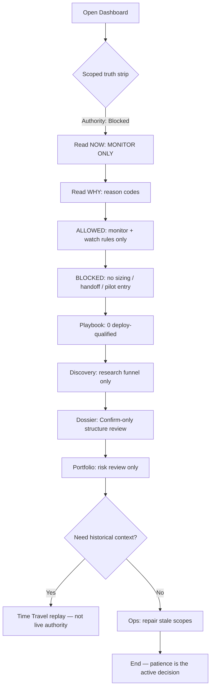
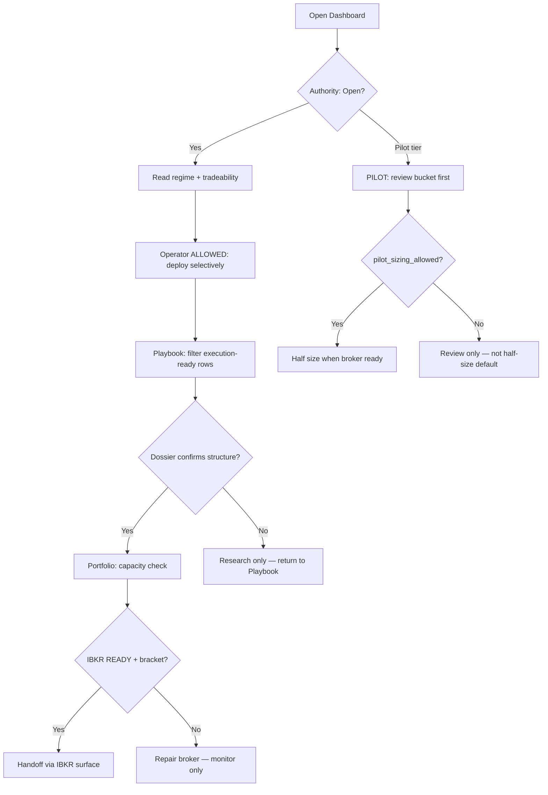

# Daily Operator Flow

Blocked-day and allowed-day paths for the Operator Decision OS.  
**SSOT:** `src/services/authority_engine.py`, `src/services/operator_surface.py`

---

## Blocked Day Path

When `deploy_authority_tier` = `blocked` or L1 page gate is closed.

### Steps

1. **Dashboard** — confirm `MONITOR ONLY · Deploy blocked` in operator block; read scoped strip (any Stale/Expired scope reinforces block).
2. **Do not size** from Playbook PILOT/TRADE labels — review-only on blocked days.
3. **Playbook** — check qualification line shows `0 deploy-qualified`; use for watchlist ranking only.
4. **Discovery / Flow / RS** — promote interesting names to Playbook/Dossier; no actionable language.
5. **Dossier** — `Confirm-only · 僅結構確認`; no trade plan, no sizing guidance.
6. **Portfolio** — reconcile book vs broker; capital action queue disabled when offline.
7. **Ops** — fix engine/provider/broker blockers from `repair_priority`.
8. **Strategy Lab / Backtest** — research drafts only; no promotion path.
9. **Time Travel** (optional) — replay for education; exit before any live action.

---

## Allowed Day Path

When `deploy_authority_tier` = `allowed` and L1–L4 are clear.

### Steps

1. **Dashboard** — regime primary (TRADE/SELECTIVE); all scopes Fresh or acceptable; `Authority: Open`.
2. **Playbook** — filter to execution-ready; cross-check deploy-qualified count > 0.
3. **Dossier** — structure confirmation for top names; dossier still not standalone permission.
4. **Portfolio** — heat, correlation, restraint governor clear.
5. **IBKR** — session active (not LOGIN-only); bracket aligned.
6. **Execute** — only after L1–L5 pass; Playbook + Dashboard agree.

### Pilot tier branch

- **PILOT ≠ half-size default** — review Pilot bucket on Playbook first.
- Half-size only when `pilot_sizing_allowed()` returns true (broker online, brief/board fresh, pilot-eligible count ≥ 1).
- Otherwise: monitor only until authority opens.

### Paper tier branch

- Paper simulation drafts on Playbook — no live IBKR handoff.

---

## Quick Reference

| Signal | Blocked day | Allowed day |
|--------|-------------|-------------|
| NOW line | MONITOR ONLY | Regime / PILOT / PAPER |
| Deploy chips | Hidden / blocked | Dashboard + Playbook |
| Playbook deploy-qualified | 0 | > 0 when ready |
| Dossier mode | Confirm-only | Structure + evidence |
| Discovery | Research funnel | Research funnel |
| IBKR handoff | Blocked | When READY |
| Guide | Reference only | Reference only |
