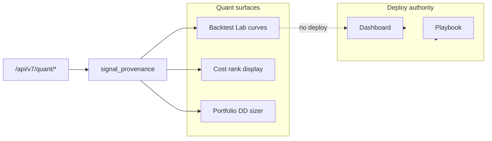

> **Superseded by [`CC_X_ENGINEERING_BACKLOG.md`](../CC_X_ENGINEERING_BACKLOG.md) and [`CC_X_ARCHITECTURE.md`](../CC_X_ARCHITECTURE.md) — retained for history only.**

# CC · Clarity Console — QUANT / ALGO / EXECUTION Upgrade Roadmap

Branch baseline: `sprint99-fund-productization` @ 4b2f409+ (builds on opportunity intelligence pass).

## 1. EXECUTIVE UPGRADE VERDICT

**Verdict: Proceed — quant/algo/execution surfaces upgraded without expanding deploy authority.**

CC gains strategy curve health (regime filters), cost-adjusted ranking, drawdown sizing templates, execution analytics, sleeve allocator hints, factor exposure, and strategy validity decay guards. All routes use `signal_provenance` ceilings; instant path serves honest `research_only` stubs. Playbook cost-rank tags and Backtest Lab Strategy Curve Console are **display-only**. Cost rank may demote sort order but **cannot override WAIT**. Fallback / stale / confirm-only blocks sizing authority. Backtest and walk-forward metrics are explicitly **not live edge**.

**Preserved:** Page gate on Dashboard / Playbook remains sole deploy surface; curves ≠ ticker deploy permission.

---

## 2. NEW FEATURE ARCHITECTURE (quant / algo / execution)

| Layer     | Strategy curve                      | Cost rank                        | DD sizer                               | Execution analytics       | Allocator                     | Factor exposure       | Validity                |
| --------- | ----------------------------------- | -------------------------------- | -------------------------------------- | ------------------------- | ----------------------------- | --------------------- | ----------------------- |
| Service   | `strategy_curve_health.py`          | `cost_adjusted_ranker.py`        | `drawdown_sizer.py`                    | `execution_analytics.py`  | `strategy_allocator.py`       | `factor_exposure.py`  | `strategy_validity.py`  |
| Authority | `research_only`                     | `research_only` (downgrade sort) | `research_only` (blocked confirm-only) | `ops_probe` / research    | `research_only`               | `research_only`       | `research_only`         |
| API       | `GET /api/v7/quant/strategy-health` | `.../cost-ranked`                | `.../drawdown-sizing`                  | `.../execution-analytics` | `.../sleeve-allocation`       | `.../factor-exposure` | `.../strategy-validity` |
| UI        | Backtest Lab curve console          | Playbook cost-rank pill          | Portfolio DD sizing card               | (ops / future)            | Dashboard sleeve hint         | (dossier future)      | Backtest research       |
| Monitor   | `strategy_health`                   | `cluster_blocked_cost`           | `cluster_blocked_dd`                   | —                         | `cluster_pilot` / deploy hint | —                     | —                       |

---

## 3. EXACT ROADMAP (immediate / medium / deep / optional)

### Immediate (this pass)

- Seven quant services + extended `strategy_curve_health` regime filter
- Extended `signal_provenance` with CAN/CANNOT helpers
- `quant_intelligence` router (7 endpoints)
- `_cc_instant.py` degraded quant stubs
- `today_insights.build_quant_cluster_hints` + `fetch_surface_state.QUANT_CLUSTER_MONITOR_LABELS`
- UI: Strategy Curve Console, cost-rank pill, sleeve hint, DD sizing card
- `cc-helpers.js` quant label helpers
- Unit tests + `test_quant_authority_boundaries.py`

### Medium

- Wire cost rank into playbook API row enrichment server-side
- Live TCA ingest for execution analytics when IBKR fills available
- Factor exposure block on Dossier
- Pass `quant_cluster_hints` into `/api/v7/today` builder server-side

### Deep

- Walk-forward live vs paper reconciliation
- Allocator integration with `fund_manager_console` capital flags
- Decay guard auto-downgrade hooks into `decision_truth_model` (downgrade-only)

### Optional

- Dedicated Quant tab (hidden command surface)
- Real-time slippage gate linkage with `slippage_gate_service`

---

## 4. FILE-LEVEL PLAN

| Action       | Path                                                                 |
| ------------ | -------------------------------------------------------------------- |
| **New**      | `src/services/cost_adjusted_ranker.py`                               |
| **New**      | `src/services/drawdown_sizer.py`                                     |
| **New**      | `src/services/execution_analytics.py`                                |
| **New**      | `src/services/strategy_allocator.py`                                 |
| **New**      | `src/services/factor_exposure.py`                                    |
| **New**      | `src/services/strategy_validity.py`                                  |
| **New**      | `src/api/routers/quant_intelligence.py`                              |
| **New**      | `tests/test_cost_adjusted_ranker.py`, `test_drawdown_sizer.py`, etc. |
| **Edit**     | `src/services/strategy_curve_health.py` — regime filter              |
| **Edit**     | `src/services/signal_provenance.py` — quant signal types             |
| **Edit**     | `src/api/main.py` — register router                                  |
| **Edit**     | `_cc_instant.py` — quant degraded handlers                           |
| **Edit**     | `src/services/today_insights.py`, `fetch_surface_state.py`           |
| **Edit**     | `src/api/static/cc-helpers.js`, `src/api/templates/index.html`       |
| **Existing** | `cost_adjusted_edge.py` (used by ranker), `surface_authority.py`     |

---

## 5. DIRECT IMPLEMENTATION (what you built)

1. **Authority contracts** — quant signal types capped at `research_only` / `ops_probe`; `quant_authority_can` / `quant_authority_cannot`.
2. **Services** — curve regime labels, cost rank tiers, DD sizing modes, execution status, sleeve routing hints, factor crowding, validity decay.
3. **API** — `/api/v7/quant/*` with API key dependency.
4. **Instant path** — `_stale_quant_intelligence_bytes` with `research_only` flag.
5. **UI** — minimal safe blocks with RESEARCH ONLY badges.
6. **Daily hooks** — quant cluster monitor types (deploy/pilot/watch/near-miss/blocked-by-cost/blocked-by-dd).

---

## 6. TEST PLAN

| Suite            | Command                                                                                                                                                                                                                                          | Expect                              |
| ---------------- | ------------------------------------------------------------------------------------------------------------------------------------------------------------------------------------------------------------------------------------------------ | ----------------------------------- |
| Quant authority  | `pytest tests/test_quant_authority_boundaries.py -q`                                                                                                                                                                                             | No deploy from curve/cost/allocator |
| Unit services    | `pytest tests/test_strategy_curve_health.py tests/test_cost_adjusted_ranker.py tests/test_drawdown_sizer.py tests/test_execution_analytics.py tests/test_strategy_allocator.py tests/test_factor_exposure.py tests/test_strategy_validity.py -q` | Labels / blocked modes              |
| Canonical subset | `pytest tests/test_surface_authority_header.py tests/test_decision_authority.py tests/test_opportunity_intelligence.py -q`                                                                                                                       | No authority regression             |
| Manual           | curl quant endpoints with `X-API-Key`; Backtest Lab → curve console                                                                                                                                                                              | MOCK/DEGRADED when instant          |

---

## 7. DO / DON'T RULES

### DO

- Keep **page gate > quant surfaces** — deploy only from Dashboard / Playbook board.
- Label quant payloads **RESEARCH ONLY** or **MOCK / DEGRADED** when stubbed.
- Use cost rank to **demote** weak net edge rows; still honor WAIT.
- Block DD sizer on **confirm-only / fallback / stale**.
- Show strategy curves in **Backtest Lab** with `deploy_from_curve_alone: false`.
- Treat execution analytics as **ops context**, not edge proof.

### DON'T

- Don't set `may_authorize_deploy` on quant signal types.
- Don't let cost rank override **WAIT** tradeability.
- Don't conflate `strategy_health_service` (realized trades) with `strategy_curve_health` (walk-forward).
- Don't claim **live edge** from backtest validity or curve health.
- Don't route orders from **allocator hints**.
- Don't hide mock/degraded — expose `data_tier` and `degraded` in API + UI.
